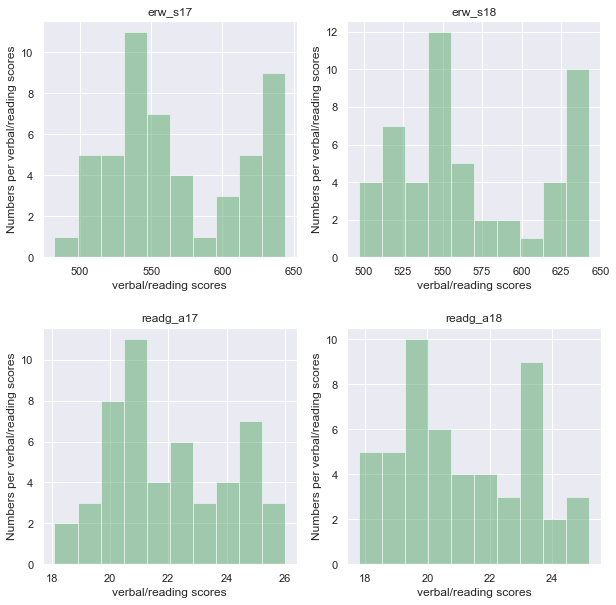

# Project 1: SAT & ACT Analysis

## Executive Summary

If you want to, it's great to use relative links to direct your audience to various sections of a notebook. **HERE'S A DEMONSTRATION WITH THE CURRENT SECTION HEADERS**:

### Contents:
- [2017 Data Import & Cleaning](#Data-Import-and-Cleaning)
- [2018 Data Import and Cleaning](#2018-Data-Import-and-Cleaning)
- [Exploratory Data Analysis](#Exploratory-Data-Analysis)
- [Data Visualization](#Visualize-the-data)
- [Descriptive and Inferential Statistics](#Descriptive-and-Inferential-Statistics)
- [Outside Research](#Outside-Research)
- [Conclusions and Recommendations](#Conclusions-and-Recommendations)

**If you combine your problem statement, executive summary, data dictionary, and conclusions/recommendations, you have an amazing README.md file that quickly aligns your audience to the contents of your project.** Don't forget to cite your data sources!

*All libraries used should be added here*


```python
import numpy as np
import pandas as pd
```

## 2017 Data Import and Cleaning

#### 1. Read In SAT & ACT  Data

Read in the `sat_2017.csv` and `act_2017.csv` files and assign them to appropriately named pandas dataframes.


```python
sat_2017 = '../data/sat_2017.csv'
act_2017 = '../data/act_2017.csv'

with open(sat_2017, mode="r") as sat17:
    sat17 = pd.read_csv(sat17)

with open(act_2017, mode="r") as act17:
    act17 = pd.read_csv(act17)
```

#### 2. Display Data

Print the first 10 rows of each dataframe to your jupyter notebook


```python
sat17.head(10)
```


<div>
<style scoped>
    .dataframe tbody tr th:only-of-type {
        vertical-align: middle;
    }

    .dataframe tbody tr th {
        vertical-align: top;
    }

    .dataframe thead th {
        text-align: right;
    }
</style>
<table border="1" class="dataframe">
  <thead>
    <tr style="text-align: right;">
      <th></th>
      <th>State</th>
      <th>Participation</th>
      <th>Evidence-Based Reading and Writing</th>
      <th>Math</th>
      <th>Total</th>
    </tr>
  </thead>
  <tbody>
    <tr>
      <th>0</th>
      <td>Alabama</td>
      <td>5%</td>
      <td>593</td>
      <td>572</td>
      <td>1165</td>
    </tr>
    <tr>
      <th>1</th>
      <td>Alaska</td>
      <td>38%</td>
      <td>547</td>
      <td>533</td>
      <td>1080</td>
    </tr>
    <tr>
      <th>2</th>
      <td>Arizona</td>
      <td>30%</td>
      <td>563</td>
      <td>553</td>
      <td>1116</td>
    </tr>
    <tr>
      <th>3</th>
      <td>Arkansas</td>
      <td>3%</td>
      <td>614</td>
      <td>594</td>
      <td>1208</td>
    </tr>
    <tr>
      <th>4</th>
      <td>California</td>
      <td>53%</td>
      <td>531</td>
      <td>524</td>
      <td>1055</td>
    </tr>
    <tr>
      <th>5</th>
      <td>Colorado</td>
      <td>11%</td>
      <td>606</td>
      <td>595</td>
      <td>1201</td>
    </tr>
    <tr>
      <th>6</th>
      <td>Connecticut</td>
      <td>100%</td>
      <td>530</td>
      <td>512</td>
      <td>1041</td>
    </tr>
    <tr>
      <th>7</th>
      <td>Delaware</td>
      <td>100%</td>
      <td>503</td>
      <td>492</td>
      <td>996</td>
    </tr>
    <tr>
      <th>8</th>
      <td>District of Columbia</td>
      <td>100%</td>
      <td>482</td>
      <td>468</td>
      <td>950</td>
    </tr>
    <tr>
      <th>9</th>
      <td>Florida</td>
      <td>83%</td>
      <td>520</td>
      <td>497</td>
      <td>1017</td>
    </tr>
  </tbody>
</table>
</div>


```python
act17.head(10)
```


<div>
<style scoped>
    .dataframe tbody tr th:only-of-type {
        vertical-align: middle;
    }

    .dataframe tbody tr th {
        vertical-align: top;
    }

    .dataframe thead th {
        text-align: right;
    }
</style>
<table border="1" class="dataframe">
  <thead>
    <tr style="text-align: right;">
      <th></th>
      <th>State</th>
      <th>Participation</th>
      <th>English</th>
      <th>Math</th>
      <th>Reading</th>
      <th>Science</th>
      <th>Composite</th>
    </tr>
  </thead>
  <tbody>
    <tr>
      <th>0</th>
      <td>National</td>
      <td>60%</td>
      <td>20.3</td>
      <td>20.7</td>
      <td>21.4</td>
      <td>21.0</td>
      <td>21.0</td>
    </tr>
    <tr>
      <th>1</th>
      <td>Alabama</td>
      <td>100%</td>
      <td>18.9</td>
      <td>18.4</td>
      <td>19.7</td>
      <td>19.4</td>
      <td>19.2</td>
    </tr>
    <tr>
      <th>2</th>
      <td>Alaska</td>
      <td>65%</td>
      <td>18.7</td>
      <td>19.8</td>
      <td>20.4</td>
      <td>19.9</td>
      <td>19.8</td>
    </tr>
    <tr>
      <th>3</th>
      <td>Arizona</td>
      <td>62%</td>
      <td>18.6</td>
      <td>19.8</td>
      <td>20.1</td>
      <td>19.8</td>
      <td>19.7</td>
    </tr>
    <tr>
      <th>4</th>
      <td>Arkansas</td>
      <td>100%</td>
      <td>18.9</td>
      <td>19.0</td>
      <td>19.7</td>
      <td>19.5</td>
      <td>19.4</td>
    </tr>
    <tr>
      <th>5</th>
      <td>California</td>
      <td>31%</td>
      <td>22.5</td>
      <td>22.7</td>
      <td>23.1</td>
      <td>22.2</td>
      <td>22.8</td>
    </tr>
    <tr>
      <th>6</th>
      <td>Colorado</td>
      <td>100%</td>
      <td>20.1</td>
      <td>20.3</td>
      <td>21.2</td>
      <td>20.9</td>
      <td>20.8</td>
    </tr>
    <tr>
      <th>7</th>
      <td>Connecticut</td>
      <td>31%</td>
      <td>25.5</td>
      <td>24.6</td>
      <td>25.6</td>
      <td>24.6</td>
      <td>25.2</td>
    </tr>
    <tr>
      <th>8</th>
      <td>Delaware</td>
      <td>18%</td>
      <td>24.1</td>
      <td>23.4</td>
      <td>24.8</td>
      <td>23.6</td>
      <td>24.1</td>
    </tr>
    <tr>
      <th>9</th>
      <td>District of Columbia</td>
      <td>32%</td>
      <td>24.4</td>
      <td>23.5</td>
      <td>24.9</td>
      <td>23.5</td>
      <td>24.2</td>
    </tr>
  </tbody>
</table>
</div>


#### 3. Verbally Describe Data

Take your time looking through the data and thoroughly describe the data in the markdown cell below. 


```python
sat17.describe()
```


<div>
<style scoped>
    .dataframe tbody tr th:only-of-type {
        vertical-align: middle;
    }

    .dataframe tbody tr th {
        vertical-align: top;
    }

    .dataframe thead th {
        text-align: right;
    }
</style>
<table border="1" class="dataframe">
  <thead>
    <tr style="text-align: right;">
      <th></th>
      <th>Evidence-Based Reading and Writing</th>
      <th>Math</th>
      <th>Total</th>
    </tr>
  </thead>
  <tbody>
    <tr>
      <th>count</th>
      <td>51.000000</td>
      <td>51.000000</td>
      <td>51.000000</td>
    </tr>
    <tr>
      <th>mean</th>
      <td>569.117647</td>
      <td>547.627451</td>
      <td>1126.098039</td>
    </tr>
    <tr>
      <th>std</th>
      <td>45.666901</td>
      <td>84.909119</td>
      <td>92.494812</td>
    </tr>
    <tr>
      <th>min</th>
      <td>482.000000</td>
      <td>52.000000</td>
      <td>950.000000</td>
    </tr>
    <tr>
      <th>25%</th>
      <td>533.500000</td>
      <td>522.000000</td>
      <td>1055.500000</td>
    </tr>
    <tr>
      <th>50%</th>
      <td>559.000000</td>
      <td>548.000000</td>
      <td>1107.000000</td>
    </tr>
    <tr>
      <th>75%</th>
      <td>613.000000</td>
      <td>599.000000</td>
      <td>1212.000000</td>
    </tr>
    <tr>
      <th>max</th>
      <td>644.000000</td>
      <td>651.000000</td>
      <td>1295.000000</td>
    </tr>
  </tbody>
</table>
</div>


```python
act17.describe()
```


<div>
<style scoped>
    .dataframe tbody tr th:only-of-type {
        vertical-align: middle;
    }

    .dataframe tbody tr th {
        vertical-align: top;
    }

    .dataframe thead th {
        text-align: right;
    }
</style>
<table border="1" class="dataframe">
  <thead>
    <tr style="text-align: right;">
      <th></th>
      <th>English</th>
      <th>Math</th>
      <th>Reading</th>
      <th>Science</th>
    </tr>
  </thead>
  <tbody>
    <tr>
      <th>count</th>
      <td>52.000000</td>
      <td>52.000000</td>
      <td>52.000000</td>
      <td>52.000000</td>
    </tr>
    <tr>
      <th>mean</th>
      <td>20.919231</td>
      <td>21.173077</td>
      <td>22.001923</td>
      <td>21.040385</td>
    </tr>
    <tr>
      <th>std</th>
      <td>2.332132</td>
      <td>1.963602</td>
      <td>2.048672</td>
      <td>3.151113</td>
    </tr>
    <tr>
      <th>min</th>
      <td>16.300000</td>
      <td>18.000000</td>
      <td>18.100000</td>
      <td>2.300000</td>
    </tr>
    <tr>
      <th>25%</th>
      <td>19.000000</td>
      <td>19.400000</td>
      <td>20.475000</td>
      <td>19.900000</td>
    </tr>
    <tr>
      <th>50%</th>
      <td>20.550000</td>
      <td>20.900000</td>
      <td>21.700000</td>
      <td>21.150000</td>
    </tr>
    <tr>
      <th>75%</th>
      <td>23.300000</td>
      <td>23.100000</td>
      <td>24.125000</td>
      <td>22.525000</td>
    </tr>
    <tr>
      <th>max</th>
      <td>25.500000</td>
      <td>25.300000</td>
      <td>26.000000</td>
      <td>24.900000</td>
    </tr>
  </tbody>
</table>
</div>


Answer: 

For sat17 and act17, most data types are floats. 
Count across variables for SAT 2017 and ACT 2017 are consistant, indicate no missing values. 
For sat17, values range from 400+ to 1100, except for Math. Need to check for math
for act17, values range from 16 to 26, except for Science. Need to check as well

#### 4a. Does the data look complete? 

Answer:

Knowing that in the USA, there are 50 states plus 1 Washington DC District. There should be only 51 mentioned 'states' in both ACT and SAT results.
ACT has an additional 1 count, on further investigation, it seemed to be the consolidation of National results.
This would be dropped as each row should represent results from individual states.

#### 4b. Are there any obvious issues with the observations?

**What is the minimum *possible* value for each test/subtest? What is the maximum *possible* value?**

Consider comparing any questionable values to the sources of your data:
- [SAT](https://blog.collegevine.com/here-are-the-average-sat-scores-by-state/)
- [ACT](https://blog.prepscholar.com/act-scores-by-state-averages-highs-and-lows)

Answer:

Checked with source for SAT 2017 and ACT2017, seemed that there were some errors with csv raw data.

#### 4c. Fix any errors you identified

**The data is available** so there's no need to guess or calculate anything. If you didn't find any errors, continue to the next step.


```python
# Utilising masking to replace errors in csv raw data.
sat17.loc[(sat17.State == "Maryland") & (sat17.Participation == "69%") & (sat17.Total == 1060), "Math"] = 524
act17.loc[(act17.State == "Maryland") & (act17.Participation == "28%") & (act17.Composite == "23.6"), "Science"] = 23.2
act17.loc[(act17.State == "Wyoming") & (act17.Participation == "100%") & (act17.English == 19.4), "Composite"] = 20.2
```


```python
sat17.describe()
```


<div>
<style scoped>
    .dataframe tbody tr th:only-of-type {
        vertical-align: middle;
    }

    .dataframe tbody tr th {
        vertical-align: top;
    }

    .dataframe thead th {
        text-align: right;
    }
</style>
<table border="1" class="dataframe">
  <thead>
    <tr style="text-align: right;">
      <th></th>
      <th>Evidence-Based Reading and Writing</th>
      <th>Math</th>
      <th>Total</th>
    </tr>
  </thead>
  <tbody>
    <tr>
      <th>count</th>
      <td>51.000000</td>
      <td>51.000000</td>
      <td>51.000000</td>
    </tr>
    <tr>
      <th>mean</th>
      <td>569.117647</td>
      <td>556.882353</td>
      <td>1126.098039</td>
    </tr>
    <tr>
      <th>std</th>
      <td>45.666901</td>
      <td>47.121395</td>
      <td>92.494812</td>
    </tr>
    <tr>
      <th>min</th>
      <td>482.000000</td>
      <td>468.000000</td>
      <td>950.000000</td>
    </tr>
    <tr>
      <th>25%</th>
      <td>533.500000</td>
      <td>523.500000</td>
      <td>1055.500000</td>
    </tr>
    <tr>
      <th>50%</th>
      <td>559.000000</td>
      <td>548.000000</td>
      <td>1107.000000</td>
    </tr>
    <tr>
      <th>75%</th>
      <td>613.000000</td>
      <td>599.000000</td>
      <td>1212.000000</td>
    </tr>
    <tr>
      <th>max</th>
      <td>644.000000</td>
      <td>651.000000</td>
      <td>1295.000000</td>
    </tr>
  </tbody>
</table>
</div>


```python
act17.describe()
```


<div>
<style scoped>
    .dataframe tbody tr th:only-of-type {
        vertical-align: middle;
    }

    .dataframe tbody tr th {
        vertical-align: top;
    }

    .dataframe thead th {
        text-align: right;
    }
</style>
<table border="1" class="dataframe">
  <thead>
    <tr style="text-align: right;">
      <th></th>
      <th>English</th>
      <th>Math</th>
      <th>Reading</th>
      <th>Science</th>
    </tr>
  </thead>
  <tbody>
    <tr>
      <th>count</th>
      <td>52.000000</td>
      <td>52.000000</td>
      <td>52.000000</td>
      <td>52.000000</td>
    </tr>
    <tr>
      <th>mean</th>
      <td>20.919231</td>
      <td>21.173077</td>
      <td>22.001923</td>
      <td>21.442308</td>
    </tr>
    <tr>
      <th>std</th>
      <td>2.332132</td>
      <td>1.963602</td>
      <td>2.048672</td>
      <td>1.723351</td>
    </tr>
    <tr>
      <th>min</th>
      <td>16.300000</td>
      <td>18.000000</td>
      <td>18.100000</td>
      <td>18.200000</td>
    </tr>
    <tr>
      <th>25%</th>
      <td>19.000000</td>
      <td>19.400000</td>
      <td>20.475000</td>
      <td>19.975000</td>
    </tr>
    <tr>
      <th>50%</th>
      <td>20.550000</td>
      <td>20.900000</td>
      <td>21.700000</td>
      <td>21.300000</td>
    </tr>
    <tr>
      <th>75%</th>
      <td>23.300000</td>
      <td>23.100000</td>
      <td>24.125000</td>
      <td>23.200000</td>
    </tr>
    <tr>
      <th>max</th>
      <td>25.500000</td>
      <td>25.300000</td>
      <td>26.000000</td>
      <td>24.900000</td>
    </tr>
  </tbody>
</table>
</div>


#### 5. What are your data types? 
Display the data types of each feature. 


```python
sat17.dtypes
```


    State                                 object
    Participation                         object
    Evidence-Based Reading and Writing     int64
    Math                                   int64
    Total                                  int64
    dtype: object


```python
act17.dtypes
```


    State             object
    Participation     object
    English          float64
    Math             float64
    Reading          float64
    Science          float64
    Composite         object
    dtype: object


What did you learn?
- Do any of them seem odd?  
- Which ones are not as they should be?  

Answer:

Participation rates for ACT and SAT 2017, and Composite from ACT 2017 shld be either float or int data type 

#### 6. Fix Incorrect Data Types
Based on what you discovered above, use appropriate methods to re-type incorrectly typed data.
- Define a function that will allow you to convert participation rates to an appropriate numeric type. Use `map` or `apply` to change these columns in each dataframe.


```python
def coerce_df_columns_to_numeric(df, column_list):
    df[column_list] = df[column_list].apply(pd.to_numeric, errors='coerce')
    return df
```

- Fix any individual values preventing other columns from being the appropriate type.


```python
# To remove '%' from the last character in Participation column
sat17["Participation"] = [x[:-1] for x in sat17["Participation"]] 
act17["Participation"] = [x[:-1] for x in act17["Participation"]] 
```

- Finish your data modifications by making sure the columns are now typed appropriately.


```python
# To convert string data type to either int or float
coerce_df_columns_to_numeric(sat17, "Participation")                
coerce_df_columns_to_numeric(act17, ["Participation", "Composite"]) 
```


<div>
<style scoped>
    .dataframe tbody tr th:only-of-type {
        vertical-align: middle;
    }

    .dataframe tbody tr th {
        vertical-align: top;
    }

    .dataframe thead th {
        text-align: right;
    }
</style>
<table border="1" class="dataframe">
  <thead>
    <tr style="text-align: right;">
      <th></th>
      <th>State</th>
      <th>Participation</th>
      <th>English</th>
      <th>Math</th>
      <th>Reading</th>
      <th>Science</th>
      <th>Composite</th>
    </tr>
  </thead>
  <tbody>
    <tr>
      <th>0</th>
      <td>National</td>
      <td>60</td>
      <td>20.3</td>
      <td>20.7</td>
      <td>21.4</td>
      <td>21.0</td>
      <td>21.0</td>
    </tr>
    <tr>
      <th>1</th>
      <td>Alabama</td>
      <td>100</td>
      <td>18.9</td>
      <td>18.4</td>
      <td>19.7</td>
      <td>19.4</td>
      <td>19.2</td>
    </tr>
    <tr>
      <th>2</th>
      <td>Alaska</td>
      <td>65</td>
      <td>18.7</td>
      <td>19.8</td>
      <td>20.4</td>
      <td>19.9</td>
      <td>19.8</td>
    </tr>
    <tr>
      <th>3</th>
      <td>Arizona</td>
      <td>62</td>
      <td>18.6</td>
      <td>19.8</td>
      <td>20.1</td>
      <td>19.8</td>
      <td>19.7</td>
    </tr>
    <tr>
      <th>4</th>
      <td>Arkansas</td>
      <td>100</td>
      <td>18.9</td>
      <td>19.0</td>
      <td>19.7</td>
      <td>19.5</td>
      <td>19.4</td>
    </tr>
    <tr>
      <th>5</th>
      <td>California</td>
      <td>31</td>
      <td>22.5</td>
      <td>22.7</td>
      <td>23.1</td>
      <td>22.2</td>
      <td>22.8</td>
    </tr>
    <tr>
      <th>6</th>
      <td>Colorado</td>
      <td>100</td>
      <td>20.1</td>
      <td>20.3</td>
      <td>21.2</td>
      <td>20.9</td>
      <td>20.8</td>
    </tr>
    <tr>
      <th>7</th>
      <td>Connecticut</td>
      <td>31</td>
      <td>25.5</td>
      <td>24.6</td>
      <td>25.6</td>
      <td>24.6</td>
      <td>25.2</td>
    </tr>
    <tr>
      <th>8</th>
      <td>Delaware</td>
      <td>18</td>
      <td>24.1</td>
      <td>23.4</td>
      <td>24.8</td>
      <td>23.6</td>
      <td>24.1</td>
    </tr>
    <tr>
      <th>9</th>
      <td>District of Columbia</td>
      <td>32</td>
      <td>24.4</td>
      <td>23.5</td>
      <td>24.9</td>
      <td>23.5</td>
      <td>24.2</td>
    </tr>
    <tr>
      <th>10</th>
      <td>Florida</td>
      <td>73</td>
      <td>19.0</td>
      <td>19.4</td>
      <td>21.0</td>
      <td>19.4</td>
      <td>19.8</td>
    </tr>
    <tr>
      <th>11</th>
      <td>Georgia</td>
      <td>55</td>
      <td>21.0</td>
      <td>20.9</td>
      <td>22.0</td>
      <td>21.3</td>
      <td>21.4</td>
    </tr>
    <tr>
      <th>12</th>
      <td>Hawaii</td>
      <td>90</td>
      <td>17.8</td>
      <td>19.2</td>
      <td>19.2</td>
      <td>19.3</td>
      <td>19.0</td>
    </tr>
    <tr>
      <th>13</th>
      <td>Idaho</td>
      <td>38</td>
      <td>21.9</td>
      <td>21.8</td>
      <td>23.0</td>
      <td>22.1</td>
      <td>22.3</td>
    </tr>
    <tr>
      <th>14</th>
      <td>Illinois</td>
      <td>93</td>
      <td>21.0</td>
      <td>21.2</td>
      <td>21.6</td>
      <td>21.3</td>
      <td>21.4</td>
    </tr>
    <tr>
      <th>15</th>
      <td>Indiana</td>
      <td>35</td>
      <td>22.0</td>
      <td>22.4</td>
      <td>23.2</td>
      <td>22.3</td>
      <td>22.6</td>
    </tr>
    <tr>
      <th>16</th>
      <td>Iowa</td>
      <td>67</td>
      <td>21.2</td>
      <td>21.3</td>
      <td>22.6</td>
      <td>22.1</td>
      <td>21.9</td>
    </tr>
    <tr>
      <th>17</th>
      <td>Kansas</td>
      <td>73</td>
      <td>21.1</td>
      <td>21.3</td>
      <td>22.3</td>
      <td>21.7</td>
      <td>21.7</td>
    </tr>
    <tr>
      <th>18</th>
      <td>Kentucky</td>
      <td>100</td>
      <td>19.6</td>
      <td>19.4</td>
      <td>20.5</td>
      <td>20.1</td>
      <td>20.0</td>
    </tr>
    <tr>
      <th>19</th>
      <td>Louisiana</td>
      <td>100</td>
      <td>19.4</td>
      <td>18.8</td>
      <td>19.8</td>
      <td>19.6</td>
      <td>19.5</td>
    </tr>
    <tr>
      <th>20</th>
      <td>Maine</td>
      <td>8</td>
      <td>24.2</td>
      <td>24.0</td>
      <td>24.8</td>
      <td>23.7</td>
      <td>24.3</td>
    </tr>
    <tr>
      <th>21</th>
      <td>Maryland</td>
      <td>28</td>
      <td>23.3</td>
      <td>23.1</td>
      <td>24.2</td>
      <td>23.2</td>
      <td>23.6</td>
    </tr>
    <tr>
      <th>22</th>
      <td>Massachusetts</td>
      <td>29</td>
      <td>25.4</td>
      <td>25.3</td>
      <td>25.9</td>
      <td>24.7</td>
      <td>25.4</td>
    </tr>
    <tr>
      <th>23</th>
      <td>Michigan</td>
      <td>29</td>
      <td>24.1</td>
      <td>23.7</td>
      <td>24.5</td>
      <td>23.8</td>
      <td>24.1</td>
    </tr>
    <tr>
      <th>24</th>
      <td>Minnesota</td>
      <td>100</td>
      <td>20.4</td>
      <td>21.5</td>
      <td>21.8</td>
      <td>21.6</td>
      <td>21.5</td>
    </tr>
    <tr>
      <th>25</th>
      <td>Mississippi</td>
      <td>100</td>
      <td>18.2</td>
      <td>18.1</td>
      <td>18.8</td>
      <td>18.8</td>
      <td>18.6</td>
    </tr>
    <tr>
      <th>26</th>
      <td>Missouri</td>
      <td>100</td>
      <td>19.8</td>
      <td>19.9</td>
      <td>20.8</td>
      <td>20.5</td>
      <td>20.4</td>
    </tr>
    <tr>
      <th>27</th>
      <td>Montana</td>
      <td>100</td>
      <td>19.0</td>
      <td>20.2</td>
      <td>21.0</td>
      <td>20.5</td>
      <td>20.3</td>
    </tr>
    <tr>
      <th>28</th>
      <td>Nebraska</td>
      <td>84</td>
      <td>20.9</td>
      <td>20.9</td>
      <td>21.9</td>
      <td>21.5</td>
      <td>21.4</td>
    </tr>
    <tr>
      <th>29</th>
      <td>Nevada</td>
      <td>100</td>
      <td>16.3</td>
      <td>18.0</td>
      <td>18.1</td>
      <td>18.2</td>
      <td>17.8</td>
    </tr>
    <tr>
      <th>30</th>
      <td>New Hampshire</td>
      <td>18</td>
      <td>25.4</td>
      <td>25.1</td>
      <td>26.0</td>
      <td>24.9</td>
      <td>25.5</td>
    </tr>
    <tr>
      <th>31</th>
      <td>New Jersey</td>
      <td>34</td>
      <td>23.8</td>
      <td>23.8</td>
      <td>24.1</td>
      <td>23.2</td>
      <td>23.9</td>
    </tr>
    <tr>
      <th>32</th>
      <td>New Mexico</td>
      <td>66</td>
      <td>18.6</td>
      <td>19.4</td>
      <td>20.4</td>
      <td>20.0</td>
      <td>19.7</td>
    </tr>
    <tr>
      <th>33</th>
      <td>New York</td>
      <td>31</td>
      <td>23.8</td>
      <td>24.0</td>
      <td>24.6</td>
      <td>23.9</td>
      <td>24.2</td>
    </tr>
    <tr>
      <th>34</th>
      <td>North Carolina</td>
      <td>100</td>
      <td>17.8</td>
      <td>19.3</td>
      <td>19.6</td>
      <td>19.3</td>
      <td>19.1</td>
    </tr>
    <tr>
      <th>35</th>
      <td>North Dakota</td>
      <td>98</td>
      <td>19.0</td>
      <td>20.4</td>
      <td>20.5</td>
      <td>20.6</td>
      <td>20.3</td>
    </tr>
    <tr>
      <th>36</th>
      <td>Ohio</td>
      <td>75</td>
      <td>21.2</td>
      <td>21.6</td>
      <td>22.5</td>
      <td>22.0</td>
      <td>22.0</td>
    </tr>
    <tr>
      <th>37</th>
      <td>Oklahoma</td>
      <td>100</td>
      <td>18.5</td>
      <td>18.8</td>
      <td>20.1</td>
      <td>19.6</td>
      <td>19.4</td>
    </tr>
    <tr>
      <th>38</th>
      <td>Oregon</td>
      <td>40</td>
      <td>21.2</td>
      <td>21.5</td>
      <td>22.4</td>
      <td>21.7</td>
      <td>21.8</td>
    </tr>
    <tr>
      <th>39</th>
      <td>Pennsylvania</td>
      <td>23</td>
      <td>23.4</td>
      <td>23.4</td>
      <td>24.2</td>
      <td>23.3</td>
      <td>23.7</td>
    </tr>
    <tr>
      <th>40</th>
      <td>Rhode Island</td>
      <td>21</td>
      <td>24.0</td>
      <td>23.3</td>
      <td>24.7</td>
      <td>23.4</td>
      <td>24.0</td>
    </tr>
    <tr>
      <th>41</th>
      <td>South Carolina</td>
      <td>100</td>
      <td>17.5</td>
      <td>18.6</td>
      <td>19.1</td>
      <td>18.9</td>
      <td>18.7</td>
    </tr>
    <tr>
      <th>42</th>
      <td>South Dakota</td>
      <td>80</td>
      <td>20.7</td>
      <td>21.5</td>
      <td>22.3</td>
      <td>22.0</td>
      <td>21.8</td>
    </tr>
    <tr>
      <th>43</th>
      <td>Tennessee</td>
      <td>100</td>
      <td>19.5</td>
      <td>19.2</td>
      <td>20.1</td>
      <td>19.9</td>
      <td>19.8</td>
    </tr>
    <tr>
      <th>44</th>
      <td>Texas</td>
      <td>45</td>
      <td>19.5</td>
      <td>20.7</td>
      <td>21.1</td>
      <td>20.9</td>
      <td>20.7</td>
    </tr>
    <tr>
      <th>45</th>
      <td>Utah</td>
      <td>100</td>
      <td>19.5</td>
      <td>19.9</td>
      <td>20.8</td>
      <td>20.6</td>
      <td>20.3</td>
    </tr>
    <tr>
      <th>46</th>
      <td>Vermont</td>
      <td>29</td>
      <td>23.3</td>
      <td>23.1</td>
      <td>24.4</td>
      <td>23.2</td>
      <td>23.6</td>
    </tr>
    <tr>
      <th>47</th>
      <td>Virginia</td>
      <td>29</td>
      <td>23.5</td>
      <td>23.3</td>
      <td>24.6</td>
      <td>23.5</td>
      <td>23.8</td>
    </tr>
    <tr>
      <th>48</th>
      <td>Washington</td>
      <td>29</td>
      <td>20.9</td>
      <td>21.9</td>
      <td>22.1</td>
      <td>22.0</td>
      <td>21.9</td>
    </tr>
    <tr>
      <th>49</th>
      <td>West Virginia</td>
      <td>69</td>
      <td>20.0</td>
      <td>19.4</td>
      <td>21.2</td>
      <td>20.5</td>
      <td>20.4</td>
    </tr>
    <tr>
      <th>50</th>
      <td>Wisconsin</td>
      <td>100</td>
      <td>19.7</td>
      <td>20.4</td>
      <td>20.6</td>
      <td>20.9</td>
      <td>20.5</td>
    </tr>
    <tr>
      <th>51</th>
      <td>Wyoming</td>
      <td>100</td>
      <td>19.4</td>
      <td>19.8</td>
      <td>20.8</td>
      <td>20.6</td>
      <td>20.2</td>
    </tr>
  </tbody>
</table>
</div>


```python
# To represent Participation rates to percentages value with 100% being 1.00
sat17["Participation"] = [x/100 for x in sat17["Participation"]] 
act17["Participation"] = [x/100 for x in act17["Participation"]]
```

- Display the data types again to confirm they are correct.


```python
act17.describe()
```


<div>
<style scoped>
    .dataframe tbody tr th:only-of-type {
        vertical-align: middle;
    }

    .dataframe tbody tr th {
        vertical-align: top;
    }

    .dataframe thead th {
        text-align: right;
    }
</style>
<table border="1" class="dataframe">
  <thead>
    <tr style="text-align: right;">
      <th></th>
      <th>Participation</th>
      <th>English</th>
      <th>Math</th>
      <th>Reading</th>
      <th>Science</th>
      <th>Composite</th>
    </tr>
  </thead>
  <tbody>
    <tr>
      <th>count</th>
      <td>52.000000</td>
      <td>52.000000</td>
      <td>52.000000</td>
      <td>52.000000</td>
      <td>52.000000</td>
      <td>52.000000</td>
    </tr>
    <tr>
      <th>mean</th>
      <td>0.651538</td>
      <td>20.919231</td>
      <td>21.173077</td>
      <td>22.001923</td>
      <td>21.442308</td>
      <td>21.509615</td>
    </tr>
    <tr>
      <th>std</th>
      <td>0.318325</td>
      <td>2.332132</td>
      <td>1.963602</td>
      <td>2.048672</td>
      <td>1.723351</td>
      <td>2.002083</td>
    </tr>
    <tr>
      <th>min</th>
      <td>0.080000</td>
      <td>16.300000</td>
      <td>18.000000</td>
      <td>18.100000</td>
      <td>18.200000</td>
      <td>17.800000</td>
    </tr>
    <tr>
      <th>25%</th>
      <td>0.310000</td>
      <td>19.000000</td>
      <td>19.400000</td>
      <td>20.475000</td>
      <td>19.975000</td>
      <td>19.800000</td>
    </tr>
    <tr>
      <th>50%</th>
      <td>0.680000</td>
      <td>20.550000</td>
      <td>20.900000</td>
      <td>21.700000</td>
      <td>21.300000</td>
      <td>21.400000</td>
    </tr>
    <tr>
      <th>75%</th>
      <td>1.000000</td>
      <td>23.300000</td>
      <td>23.100000</td>
      <td>24.125000</td>
      <td>23.200000</td>
      <td>23.600000</td>
    </tr>
    <tr>
      <th>max</th>
      <td>1.000000</td>
      <td>25.500000</td>
      <td>25.300000</td>
      <td>26.000000</td>
      <td>24.900000</td>
      <td>25.500000</td>
    </tr>
  </tbody>
</table>
</div>


#### 7. Rename Columns
Change the names of the columns to more expressive names so that you can tell the difference the SAT columns and the ACT columns. Your solution should map all column names being changed at once (no repeated singular name-changes). **We will be combining these data with some of the data from 2018, and so you should name columns in an appropriate way**.

**Guidelines**:
- Column names should be all lowercase (you will thank yourself when you start pushing data to SQL later in the course)
- Column names should not contain spaces (underscores will suffice--this allows for using the `df.column_name` method to access columns in addition to `df['column_name']`.
- Column names should be unique and informative (the only feature that we actually share between dataframes is the state).


```python
# To change column names to all lowercase, and identification from Test and Year
sat17.columns = ['state', 'participation_s17', 'erw_s17', 'math_s17', 'total_s17']                                    
act17.columns = ['state', 'participation_a17', 'eng_a17', 'math_a17', 'readg_a17', 'science_a17', 'composite_a17']
```


```python
act17.dtypes
```


    state                 object
    participation_a17    float64
    eng_a17              float64
    math_a17             float64
    readg_a17            float64
    science_a17          float64
    composite_a17        float64
    dtype: object


#### 8. Create a data dictionary

Now that we've fixed our data, and given it appropriate names, let's create a [data dictionary](http://library.ucmerced.edu/node/10249). 

A data dictionary provides a quick overview of features/variables/columns, alongside data types and descriptions. The more descriptive you can be, the more useful this document is.

Example of a Fictional Data Dictionary Entry: 

|Feature|Type|Dataset|Description|
|---|---|---|---|
|**county_pop**|*integer*|2010 census|The population of the county (units in thousands, where 2.5 represents 2500 people).| 
|**per_poverty**|*float*|2010 census|The percent of the county over the age of 18 living below the 200% of official US poverty rate (units percent to two decimal places 98.10 means 98.1%)|

[Here's a quick link to a short guide for formatting markdown in Jupyter notebooks](https://jupyter-notebook.readthedocs.io/en/stable/examples/Notebook/Working%20With%20Markdown%20Cells.html).

Provided is the skeleton for formatting a markdown table, with columns headers that will help you create a data dictionary to quickly summarize your data, as well as some examples. **This would be a great thing to copy and paste into your custom README for this project.**

|Feature|Type|Dataset|Description|
|---|---|---|---|
|column name|int/float/object|ACT/SAT|This is an example| 


##### SAT Data Dictionary
|Feature|Type|Dataset|Description|
|---|----|---|---|
|state_s17|object|SAT|Respective states in the USA taking SAT test in 2017| 
|participation_s17|float|SAT|Participation rate of high school graduates taking SAT test in 2017| 
|erw_s17|int|SAT|Average English-Reading-Writing scores in the state| 
|math_s17|int|SAT|Average Math scores in the state| 
|total_s17|int|SAT|Average Total scores in the state| 


##### ACT Data Dictionary
|Feature|Type|Dataset|Description|
|---|---|---|---|
|state_a17|object|ACT|Respective states in the USA taking SAT test in 2017| 
|participation_a17|float|ACT|Participation rate of high school graduates taking ACT test in 2017| 
|eng_a17|float|ACT|Average Engish scores in the state| 
|math_a17|float|ACT|Average Math scores in the state| 
|readg_a17|float|ACT|Average Reading scores in the state| 
|science_a17|float|ACT|Average Science scores in the state| 
|composite_a17|float|ACT|Average Total scores in the state| 

#### 9. Drop unnecessary rows

One of our dataframes contains an extra row. Identify and remove this from the dataframe.


```python
# Set index to 'state' col in order to drop row with index 'National'
act17 = act17.set_index("state")        
act17 = act17.drop("National", axis=0)
```


```python
act17.describe()
```


<div>
<style scoped>
    .dataframe tbody tr th:only-of-type {
        vertical-align: middle;
    }

    .dataframe tbody tr th {
        vertical-align: top;
    }

    .dataframe thead th {
        text-align: right;
    }
</style>
<table border="1" class="dataframe">
  <thead>
    <tr style="text-align: right;">
      <th></th>
      <th>participation_a17</th>
      <th>eng_a17</th>
      <th>math_a17</th>
      <th>readg_a17</th>
      <th>science_a17</th>
      <th>composite_a17</th>
    </tr>
  </thead>
  <tbody>
    <tr>
      <th>count</th>
      <td>51.000000</td>
      <td>51.000000</td>
      <td>51.000000</td>
      <td>51.000000</td>
      <td>51.000000</td>
      <td>51.000000</td>
    </tr>
    <tr>
      <th>mean</th>
      <td>0.652549</td>
      <td>20.931373</td>
      <td>21.182353</td>
      <td>22.013725</td>
      <td>21.450980</td>
      <td>21.519608</td>
    </tr>
    <tr>
      <th>std</th>
      <td>0.321408</td>
      <td>2.353677</td>
      <td>1.981989</td>
      <td>2.067271</td>
      <td>1.739353</td>
      <td>2.020695</td>
    </tr>
    <tr>
      <th>min</th>
      <td>0.080000</td>
      <td>16.300000</td>
      <td>18.000000</td>
      <td>18.100000</td>
      <td>18.200000</td>
      <td>17.800000</td>
    </tr>
    <tr>
      <th>25%</th>
      <td>0.310000</td>
      <td>19.000000</td>
      <td>19.400000</td>
      <td>20.450000</td>
      <td>19.950000</td>
      <td>19.800000</td>
    </tr>
    <tr>
      <th>50%</th>
      <td>0.690000</td>
      <td>20.700000</td>
      <td>20.900000</td>
      <td>21.800000</td>
      <td>21.300000</td>
      <td>21.400000</td>
    </tr>
    <tr>
      <th>75%</th>
      <td>1.000000</td>
      <td>23.300000</td>
      <td>23.100000</td>
      <td>24.150000</td>
      <td>23.200000</td>
      <td>23.600000</td>
    </tr>
    <tr>
      <th>max</th>
      <td>1.000000</td>
      <td>25.500000</td>
      <td>25.300000</td>
      <td>26.000000</td>
      <td>24.900000</td>
      <td>25.500000</td>
    </tr>
  </tbody>
</table>
</div>


#### 10. Merge Dataframes

Join the 2017 ACT and SAT dataframes using the state in each dataframe as the key. Assign this to a new variable.


```python
combine_17 = sat17.join(act17, on="state") # Joing sat17 and act17, by using index 'state'
```

#### 11. Save your cleaned, merged dataframe

Use a relative path to save out your data as `combined_2017.csv`.


```python
# combine_17.to_csv('../data/combine_2017.csv', index = None, header=True) 
# creating a new combined file
```

## 2018 Data Import and Cleaning

Links to the 2018 ACT and SAT data are provided in the README. These data live in PDFs, and so you'll get to enjoy practicing some *manual* data collection. Save these data as a CSV in your `data` directory, and import, explore, and clean these data in the same way you did above. **Make sure you comment on your steps so it is clear *why* you are doing each process**.


```python
sat_2018 = '../data/sat_2018.csv'
act_2018 = '../data/act_2018.csv'

with open(sat_2018, mode="r") as sat18:
    sat18 = pd.read_csv(sat18)

with open(act_2018, mode="r") as act18:
    act18 = pd.read_csv(act18)
```


```python
sat18["Participation"] = [x[:-1] for x in sat18["Participation"]] # To remove '%' from the last character

coerce_df_columns_to_numeric(sat18, "Participation")                # To convert string to int or float

sat18["Participation"] = [x/100 for x in sat18["Participation"]] # To change it to %
act18["Participation"] = [x/100 for x in act18["Participation"]] # To change it to %

# change col names
sat18.columns = ['state', 'participation_s18', 'erw_s18', 'math_s18', 'total_s18']                                    
# change col names
act18.columns = ['state', 'participation_a18', 'eng_a18', 'math_a18', 'readg_a18', 'science_a18', 'composite_a18']    

# Set index to 'state' col in order to drop row with index 'National'
act18 = act18.set_index("state")                      
act18 = act18.drop("National", axis=0)
```

#### Combine your 2017 and 2018 data into a single dataframe
Joining on state names should work, assuming you formatted all your state names identically. Make sure none of your columns (other than state) have identical names. Do yourself a favor and decide if you're encoding participation rates as floats or integers and standardize this across your datasets.

Save the contents of this merged dataframe as `final.csv`.

**Use this combined dataframe for the remainder of the project**.


```python
combine_18 = sat18.join(act18, on="state") # Joing sat18 and act18, by using index 'state'
#combine_18.to_csv('../data/combine_2018.csv', index = None, header=True) # creating a new combined file

```


```python
final = pd.merge(combine_17, combine_18, on='state', how='outer') # using merge instead of join seems to work
#final.to_csv('../data/final.csv', index = None, header=True) # creating a new combined file

```

## Exploratory Data Analysis


### Summary Statistics
Transpose the output of pandas `describe` method to create a quick overview of each numeric feature.


```python
final.describe().T
```


<div>
<style scoped>
    .dataframe tbody tr th:only-of-type {
        vertical-align: middle;
    }

    .dataframe tbody tr th {
        vertical-align: top;
    }

    .dataframe thead th {
        text-align: right;
    }
</style>
<table border="1" class="dataframe">
  <thead>
    <tr style="text-align: right;">
      <th></th>
      <th>count</th>
      <th>mean</th>
      <th>std</th>
      <th>min</th>
      <th>25%</th>
      <th>50%</th>
      <th>75%</th>
      <th>max</th>
    </tr>
  </thead>
  <tbody>
    <tr>
      <th>participation_s17</th>
      <td>51.0</td>
      <td>0.398039</td>
      <td>0.352766</td>
      <td>0.02</td>
      <td>0.040</td>
      <td>0.38</td>
      <td>0.660</td>
      <td>1.0</td>
    </tr>
    <tr>
      <th>erw_s17</th>
      <td>51.0</td>
      <td>569.117647</td>
      <td>45.666901</td>
      <td>482.00</td>
      <td>533.500</td>
      <td>559.00</td>
      <td>613.000</td>
      <td>644.0</td>
    </tr>
    <tr>
      <th>math_s17</th>
      <td>51.0</td>
      <td>556.882353</td>
      <td>47.121395</td>
      <td>468.00</td>
      <td>523.500</td>
      <td>548.00</td>
      <td>599.000</td>
      <td>651.0</td>
    </tr>
    <tr>
      <th>total_s17</th>
      <td>51.0</td>
      <td>1126.098039</td>
      <td>92.494812</td>
      <td>950.00</td>
      <td>1055.500</td>
      <td>1107.00</td>
      <td>1212.000</td>
      <td>1295.0</td>
    </tr>
    <tr>
      <th>participation_a17</th>
      <td>51.0</td>
      <td>0.652549</td>
      <td>0.321408</td>
      <td>0.08</td>
      <td>0.310</td>
      <td>0.69</td>
      <td>1.000</td>
      <td>1.0</td>
    </tr>
    <tr>
      <th>eng_a17</th>
      <td>51.0</td>
      <td>20.931373</td>
      <td>2.353677</td>
      <td>16.30</td>
      <td>19.000</td>
      <td>20.70</td>
      <td>23.300</td>
      <td>25.5</td>
    </tr>
    <tr>
      <th>math_a17</th>
      <td>51.0</td>
      <td>21.182353</td>
      <td>1.981989</td>
      <td>18.00</td>
      <td>19.400</td>
      <td>20.90</td>
      <td>23.100</td>
      <td>25.3</td>
    </tr>
    <tr>
      <th>readg_a17</th>
      <td>51.0</td>
      <td>22.013725</td>
      <td>2.067271</td>
      <td>18.10</td>
      <td>20.450</td>
      <td>21.80</td>
      <td>24.150</td>
      <td>26.0</td>
    </tr>
    <tr>
      <th>science_a17</th>
      <td>51.0</td>
      <td>21.450980</td>
      <td>1.739353</td>
      <td>18.20</td>
      <td>19.950</td>
      <td>21.30</td>
      <td>23.200</td>
      <td>24.9</td>
    </tr>
    <tr>
      <th>composite_a17</th>
      <td>51.0</td>
      <td>21.519608</td>
      <td>2.020695</td>
      <td>17.80</td>
      <td>19.800</td>
      <td>21.40</td>
      <td>23.600</td>
      <td>25.5</td>
    </tr>
    <tr>
      <th>participation_s18</th>
      <td>51.0</td>
      <td>0.466275</td>
      <td>0.380142</td>
      <td>0.02</td>
      <td>0.045</td>
      <td>0.52</td>
      <td>0.795</td>
      <td>1.0</td>
    </tr>
    <tr>
      <th>erw_s18</th>
      <td>51.0</td>
      <td>567.294118</td>
      <td>45.317676</td>
      <td>497.00</td>
      <td>535.000</td>
      <td>552.00</td>
      <td>616.500</td>
      <td>643.0</td>
    </tr>
    <tr>
      <th>math_s18</th>
      <td>51.0</td>
      <td>557.254902</td>
      <td>48.887562</td>
      <td>480.00</td>
      <td>521.500</td>
      <td>547.00</td>
      <td>600.500</td>
      <td>655.0</td>
    </tr>
    <tr>
      <th>total_s18</th>
      <td>51.0</td>
      <td>1124.666667</td>
      <td>93.867069</td>
      <td>977.00</td>
      <td>1062.500</td>
      <td>1099.00</td>
      <td>1220.000</td>
      <td>1298.0</td>
    </tr>
    <tr>
      <th>participation_a18</th>
      <td>51.0</td>
      <td>0.616471</td>
      <td>0.340810</td>
      <td>0.07</td>
      <td>0.285</td>
      <td>0.66</td>
      <td>1.000</td>
      <td>1.0</td>
    </tr>
    <tr>
      <th>eng_a18</th>
      <td>51.0</td>
      <td>21.486275</td>
      <td>2.106278</td>
      <td>17.70</td>
      <td>19.950</td>
      <td>21.30</td>
      <td>23.550</td>
      <td>25.6</td>
    </tr>
    <tr>
      <th>math_a18</th>
      <td>51.0</td>
      <td>20.988235</td>
      <td>2.446356</td>
      <td>16.60</td>
      <td>19.100</td>
      <td>20.20</td>
      <td>23.700</td>
      <td>26.0</td>
    </tr>
    <tr>
      <th>readg_a18</th>
      <td>51.0</td>
      <td>21.125490</td>
      <td>2.035765</td>
      <td>17.80</td>
      <td>19.400</td>
      <td>20.70</td>
      <td>23.150</td>
      <td>25.2</td>
    </tr>
    <tr>
      <th>science_a18</th>
      <td>51.0</td>
      <td>22.015686</td>
      <td>2.167245</td>
      <td>18.00</td>
      <td>20.450</td>
      <td>21.60</td>
      <td>24.100</td>
      <td>26.1</td>
    </tr>
    <tr>
      <th>composite_a18</th>
      <td>51.0</td>
      <td>21.345098</td>
      <td>1.870114</td>
      <td>17.90</td>
      <td>19.850</td>
      <td>21.10</td>
      <td>23.050</td>
      <td>24.9</td>
    </tr>
  </tbody>
</table>
</div>


#### Manually calculate standard deviation

$$\sigma = \sqrt{\frac{1}{n}\sum_{i=1}^n(x_i - \mu)^2}$$

- Write a function to calculate standard deviation using the formula above


```python
def std_dev(col):
    var = []
    for x in col:
        var.append((1/len(col) * np.power((x - np.mean(col)), 2)))
    sig = np.sqrt(sum(var))
    return sig
```

- Use a **dictionary comprehension** to apply your standard deviation function to each numeric column in the dataframe.  **No loops**  
- Assign the output to variable `sd` as a dictionary where: 
    - Each column name is now a key 
    - That standard deviation of the column is the value 
     
*Example Output :* `{'ACT_Math': 120, 'ACT_Reading': 120, ...}`


```python
sd = {y: std_dev(final[y]) for y in final.columns[1:]}
sd
```


    {'participation_s17': 0.3492907076664507,
     'erw_s17': 45.21697020437867,
     'math_s17': 46.65713364485504,
     'total_s17': 91.58351056778743,
     'participation_a17': 0.3182417575123181,
     'eng_a17': 2.3304876369363363,
     'math_a17': 1.9624620273436781,
     'readg_a17': 2.0469029314842646,
     'science_a17': 1.722216145144367,
     'composite_a17': 2.0007860815819893,
     'participation_s18': 0.3763965409204986,
     'erw_s18': 44.87118561762388,
     'math_s18': 48.405899469194466,
     'total_s18': 92.94224786343666,
     'participation_a18': 0.3374519488199752,
     'eng_a18': 2.0855261815801143,
     'math_a18': 2.42225361432028,
     'readg_a18': 2.015707255555718,
     'science_a18': 2.145891884510421,
     'composite_a18': 1.8516885484833543}


```python
final.std()
```


    participation_s17     0.352766
    erw_s17              45.666901
    math_s17             47.121395
    total_s17            92.494812
    participation_a17     0.321408
    eng_a17               2.353677
    math_a17              1.981989
    readg_a17             2.067271
    science_a17           1.739353
    composite_a17         2.020695
    participation_s18     0.380142
    erw_s18              45.317676
    math_s18             48.887562
    total_s18            93.867069
    participation_a18     0.340810
    eng_a18               2.106278
    math_a18              2.446356
    readg_a18             2.035765
    science_a18           2.167245
    composite_a18         1.870114
    dtype: float64


Do your manually calculated standard deviations match up with the output from pandas `describe`? What about numpy's `std` method?

Answer:

These are no observable deviations between pandas `describe` method and numpy `std` method. 
And there are obervable deviations between manually calculated standard deviations with output from either pandas or numpy 


#### Investigate trends in the data
Using sorting and/or masking (along with the `.head` method to not print our entire dataframe), consider the following questions:

- Which states have the highest and lowest participation rates for the:
    - 2017 SAT?
    - 2018 SAT?
    - 2017 ACT?
    - 2018 ACT?
- Which states have the highest and lowest mean total/composite scores for the:
    - 2017 SAT?
    - 2018 SAT?
    - 2017 ACT?
    - 2018 ACT?
- Do any states with 100% participation on a given test have a rate change year-to-year?
- Do any states show have >50% participation on *both* tests either year?

Based on what you've just observed, have you identified any states that you're especially interested in? **Make a note of these and state *why* you think they're interesting**.

**You should comment on your findings at each step in a markdown cell below your code block**. Make sure you include at least one example of sorting your dataframe by a column, and one example of using boolean filtering (i.e., masking) to select a subset of the dataframe.


```python
# SAT 2017 highest and lowest participation rates 
display(sat17.sort_values(["participation_s17"], ascending=[False]).head())
display(sat17.sort_values(["participation_s17"], ascending=[False]).tail())
```


<div>
<style scoped>
    .dataframe tbody tr th:only-of-type {
        vertical-align: middle;
    }

    .dataframe tbody tr th {
        vertical-align: top;
    }

    .dataframe thead th {
        text-align: right;
    }
</style>
<table border="1" class="dataframe">
  <thead>
    <tr style="text-align: right;">
      <th></th>
      <th>state</th>
      <th>participation_s17</th>
      <th>erw_s17</th>
      <th>math_s17</th>
      <th>total_s17</th>
    </tr>
  </thead>
  <tbody>
    <tr>
      <th>8</th>
      <td>District of Columbia</td>
      <td>1.00</td>
      <td>482</td>
      <td>468</td>
      <td>950</td>
    </tr>
    <tr>
      <th>22</th>
      <td>Michigan</td>
      <td>1.00</td>
      <td>509</td>
      <td>495</td>
      <td>1005</td>
    </tr>
    <tr>
      <th>6</th>
      <td>Connecticut</td>
      <td>1.00</td>
      <td>530</td>
      <td>512</td>
      <td>1041</td>
    </tr>
    <tr>
      <th>7</th>
      <td>Delaware</td>
      <td>1.00</td>
      <td>503</td>
      <td>492</td>
      <td>996</td>
    </tr>
    <tr>
      <th>29</th>
      <td>New Hampshire</td>
      <td>0.96</td>
      <td>532</td>
      <td>520</td>
      <td>1052</td>
    </tr>
  </tbody>
</table>
</div>


<div>
<style scoped>
    .dataframe tbody tr th:only-of-type {
        vertical-align: middle;
    }

    .dataframe tbody tr th {
        vertical-align: top;
    }

    .dataframe thead th {
        text-align: right;
    }
</style>
<table border="1" class="dataframe">
  <thead>
    <tr style="text-align: right;">
      <th></th>
      <th>state</th>
      <th>participation_s17</th>
      <th>erw_s17</th>
      <th>math_s17</th>
      <th>total_s17</th>
    </tr>
  </thead>
  <tbody>
    <tr>
      <th>3</th>
      <td>Arkansas</td>
      <td>0.03</td>
      <td>614</td>
      <td>594</td>
      <td>1208</td>
    </tr>
    <tr>
      <th>50</th>
      <td>Wyoming</td>
      <td>0.03</td>
      <td>626</td>
      <td>604</td>
      <td>1230</td>
    </tr>
    <tr>
      <th>34</th>
      <td>North Dakota</td>
      <td>0.02</td>
      <td>635</td>
      <td>621</td>
      <td>1256</td>
    </tr>
    <tr>
      <th>24</th>
      <td>Mississippi</td>
      <td>0.02</td>
      <td>634</td>
      <td>607</td>
      <td>1242</td>
    </tr>
    <tr>
      <th>15</th>
      <td>Iowa</td>
      <td>0.02</td>
      <td>641</td>
      <td>635</td>
      <td>1275</td>
    </tr>
  </tbody>
</table>
</div>


```python
# SAT 2018 highest and lowest participation rates 
display(sat18.sort_values(["participation_s18"], ascending=[False]).head())
display(sat18.sort_values(["participation_s18"], ascending=[False]).tail())
```


<div>
<style scoped>
    .dataframe tbody tr th:only-of-type {
        vertical-align: middle;
    }

    .dataframe tbody tr th {
        vertical-align: top;
    }

    .dataframe thead th {
        text-align: right;
    }
</style>
<table border="1" class="dataframe">
  <thead>
    <tr style="text-align: right;">
      <th></th>
      <th>state</th>
      <th>participation_s18</th>
      <th>erw_s18</th>
      <th>math_s18</th>
      <th>total_s18</th>
    </tr>
  </thead>
  <tbody>
    <tr>
      <th>5</th>
      <td>Colorado</td>
      <td>1.0</td>
      <td>519</td>
      <td>506</td>
      <td>1025</td>
    </tr>
    <tr>
      <th>6</th>
      <td>Connecticut</td>
      <td>1.0</td>
      <td>535</td>
      <td>519</td>
      <td>1053</td>
    </tr>
    <tr>
      <th>7</th>
      <td>Delaware</td>
      <td>1.0</td>
      <td>505</td>
      <td>492</td>
      <td>998</td>
    </tr>
    <tr>
      <th>22</th>
      <td>Michigan</td>
      <td>1.0</td>
      <td>511</td>
      <td>499</td>
      <td>1011</td>
    </tr>
    <tr>
      <th>12</th>
      <td>Idaho</td>
      <td>1.0</td>
      <td>508</td>
      <td>493</td>
      <td>1001</td>
    </tr>
  </tbody>
</table>
</div>


<div>
<style scoped>
    .dataframe tbody tr th:only-of-type {
        vertical-align: middle;
    }

    .dataframe tbody tr th {
        vertical-align: top;
    }

    .dataframe thead th {
        text-align: right;
    }
</style>
<table border="1" class="dataframe">
  <thead>
    <tr style="text-align: right;">
      <th></th>
      <th>state</th>
      <th>participation_s18</th>
      <th>erw_s18</th>
      <th>math_s18</th>
      <th>total_s18</th>
    </tr>
  </thead>
  <tbody>
    <tr>
      <th>24</th>
      <td>Mississippi</td>
      <td>0.03</td>
      <td>630</td>
      <td>606</td>
      <td>1236</td>
    </tr>
    <tr>
      <th>15</th>
      <td>Iowa</td>
      <td>0.03</td>
      <td>634</td>
      <td>631</td>
      <td>1265</td>
    </tr>
    <tr>
      <th>49</th>
      <td>Wisconsin</td>
      <td>0.03</td>
      <td>641</td>
      <td>653</td>
      <td>1294</td>
    </tr>
    <tr>
      <th>50</th>
      <td>Wyoming</td>
      <td>0.03</td>
      <td>633</td>
      <td>625</td>
      <td>1258</td>
    </tr>
    <tr>
      <th>34</th>
      <td>North Dakota</td>
      <td>0.02</td>
      <td>640</td>
      <td>643</td>
      <td>1283</td>
    </tr>
  </tbody>
</table>
</div>


```python
# To reinstate index column
act18.reset_index(inplace=True)
act17.reset_index(inplace=True)
```


```python
# ACT 2017 highest and lowest participation rates 
display(act17.sort_values(["participation_a17"], ascending=[False]).head())
display(act17.sort_values(["participation_a17"], ascending=[False]).tail())
```


<div>
<style scoped>
    .dataframe tbody tr th:only-of-type {
        vertical-align: middle;
    }

    .dataframe tbody tr th {
        vertical-align: top;
    }

    .dataframe thead th {
        text-align: right;
    }
</style>
<table border="1" class="dataframe">
  <thead>
    <tr style="text-align: right;">
      <th></th>
      <th>state</th>
      <th>participation_a17</th>
      <th>eng_a17</th>
      <th>math_a17</th>
      <th>readg_a17</th>
      <th>science_a17</th>
      <th>composite_a17</th>
    </tr>
  </thead>
  <tbody>
    <tr>
      <th>0</th>
      <td>Alabama</td>
      <td>1.0</td>
      <td>18.9</td>
      <td>18.4</td>
      <td>19.7</td>
      <td>19.4</td>
      <td>19.2</td>
    </tr>
    <tr>
      <th>17</th>
      <td>Kentucky</td>
      <td>1.0</td>
      <td>19.6</td>
      <td>19.4</td>
      <td>20.5</td>
      <td>20.1</td>
      <td>20.0</td>
    </tr>
    <tr>
      <th>49</th>
      <td>Wisconsin</td>
      <td>1.0</td>
      <td>19.7</td>
      <td>20.4</td>
      <td>20.6</td>
      <td>20.9</td>
      <td>20.5</td>
    </tr>
    <tr>
      <th>44</th>
      <td>Utah</td>
      <td>1.0</td>
      <td>19.5</td>
      <td>19.9</td>
      <td>20.8</td>
      <td>20.6</td>
      <td>20.3</td>
    </tr>
    <tr>
      <th>42</th>
      <td>Tennessee</td>
      <td>1.0</td>
      <td>19.5</td>
      <td>19.2</td>
      <td>20.1</td>
      <td>19.9</td>
      <td>19.8</td>
    </tr>
  </tbody>
</table>
</div>


<div>
<style scoped>
    .dataframe tbody tr th:only-of-type {
        vertical-align: middle;
    }

    .dataframe tbody tr th {
        vertical-align: top;
    }

    .dataframe thead th {
        text-align: right;
    }
</style>
<table border="1" class="dataframe">
  <thead>
    <tr style="text-align: right;">
      <th></th>
      <th>state</th>
      <th>participation_a17</th>
      <th>eng_a17</th>
      <th>math_a17</th>
      <th>readg_a17</th>
      <th>science_a17</th>
      <th>composite_a17</th>
    </tr>
  </thead>
  <tbody>
    <tr>
      <th>38</th>
      <td>Pennsylvania</td>
      <td>0.23</td>
      <td>23.4</td>
      <td>23.4</td>
      <td>24.2</td>
      <td>23.3</td>
      <td>23.7</td>
    </tr>
    <tr>
      <th>39</th>
      <td>Rhode Island</td>
      <td>0.21</td>
      <td>24.0</td>
      <td>23.3</td>
      <td>24.7</td>
      <td>23.4</td>
      <td>24.0</td>
    </tr>
    <tr>
      <th>7</th>
      <td>Delaware</td>
      <td>0.18</td>
      <td>24.1</td>
      <td>23.4</td>
      <td>24.8</td>
      <td>23.6</td>
      <td>24.1</td>
    </tr>
    <tr>
      <th>29</th>
      <td>New Hampshire</td>
      <td>0.18</td>
      <td>25.4</td>
      <td>25.1</td>
      <td>26.0</td>
      <td>24.9</td>
      <td>25.5</td>
    </tr>
    <tr>
      <th>19</th>
      <td>Maine</td>
      <td>0.08</td>
      <td>24.2</td>
      <td>24.0</td>
      <td>24.8</td>
      <td>23.7</td>
      <td>24.3</td>
    </tr>
  </tbody>
</table>
</div>


```python
# ACT 2018 highest and lowest participation rates 
display(act18.sort_values(["participation_a18"], ascending=[False]).head())
display(act18.sort_values(["participation_a18"], ascending=[False]).tail())
```


<div>
<style scoped>
    .dataframe tbody tr th:only-of-type {
        vertical-align: middle;
    }

    .dataframe tbody tr th {
        vertical-align: top;
    }

    .dataframe thead th {
        text-align: right;
    }
</style>
<table border="1" class="dataframe">
  <thead>
    <tr style="text-align: right;">
      <th></th>
      <th>state</th>
      <th>participation_a18</th>
      <th>eng_a18</th>
      <th>math_a18</th>
      <th>readg_a18</th>
      <th>science_a18</th>
      <th>composite_a18</th>
    </tr>
  </thead>
  <tbody>
    <tr>
      <th>0</th>
      <td>Alabama</td>
      <td>1.0</td>
      <td>19.1</td>
      <td>18.9</td>
      <td>18.3</td>
      <td>19.6</td>
      <td>19.0</td>
    </tr>
    <tr>
      <th>17</th>
      <td>Kentucky</td>
      <td>1.0</td>
      <td>20.2</td>
      <td>19.9</td>
      <td>19.7</td>
      <td>20.8</td>
      <td>20.1</td>
    </tr>
    <tr>
      <th>49</th>
      <td>Wisconsin</td>
      <td>1.0</td>
      <td>20.5</td>
      <td>19.8</td>
      <td>20.3</td>
      <td>20.6</td>
      <td>20.8</td>
    </tr>
    <tr>
      <th>44</th>
      <td>Utah</td>
      <td>1.0</td>
      <td>20.4</td>
      <td>19.7</td>
      <td>19.9</td>
      <td>20.9</td>
      <td>20.5</td>
    </tr>
    <tr>
      <th>42</th>
      <td>Tennessee</td>
      <td>1.0</td>
      <td>19.6</td>
      <td>19.4</td>
      <td>19.1</td>
      <td>19.9</td>
      <td>19.6</td>
    </tr>
  </tbody>
</table>
</div>


<div>
<style scoped>
    .dataframe tbody tr th:only-of-type {
        vertical-align: middle;
    }

    .dataframe tbody tr th {
        vertical-align: top;
    }

    .dataframe thead th {
        text-align: right;
    }
</style>
<table border="1" class="dataframe">
  <thead>
    <tr style="text-align: right;">
      <th></th>
      <th>state</th>
      <th>participation_a18</th>
      <th>eng_a18</th>
      <th>math_a18</th>
      <th>readg_a18</th>
      <th>science_a18</th>
      <th>composite_a18</th>
    </tr>
  </thead>
  <tbody>
    <tr>
      <th>38</th>
      <td>Pennsylvania</td>
      <td>0.20</td>
      <td>23.5</td>
      <td>23.3</td>
      <td>23.2</td>
      <td>24.0</td>
      <td>23.1</td>
    </tr>
    <tr>
      <th>7</th>
      <td>Delaware</td>
      <td>0.17</td>
      <td>23.2</td>
      <td>23.7</td>
      <td>23.1</td>
      <td>24.5</td>
      <td>23.4</td>
    </tr>
    <tr>
      <th>29</th>
      <td>New Hampshire</td>
      <td>0.16</td>
      <td>25.1</td>
      <td>25.1</td>
      <td>24.7</td>
      <td>25.6</td>
      <td>24.4</td>
    </tr>
    <tr>
      <th>39</th>
      <td>Rhode Island</td>
      <td>0.15</td>
      <td>24.2</td>
      <td>24.4</td>
      <td>23.6</td>
      <td>25.0</td>
      <td>23.5</td>
    </tr>
    <tr>
      <th>19</th>
      <td>Maine</td>
      <td>0.07</td>
      <td>24.0</td>
      <td>23.8</td>
      <td>23.6</td>
      <td>24.7</td>
      <td>23.4</td>
    </tr>
  </tbody>
</table>
</div>


```python
# SAT 2017 highest and lowest mean total/composite scores
display(sat17.sort_values(["total_s17"], ascending=[False]).head())
display(sat17.sort_values(["total_s17"], ascending=[False]).tail())
```


<div>
<style scoped>
    .dataframe tbody tr th:only-of-type {
        vertical-align: middle;
    }

    .dataframe tbody tr th {
        vertical-align: top;
    }

    .dataframe thead th {
        text-align: right;
    }
</style>
<table border="1" class="dataframe">
  <thead>
    <tr style="text-align: right;">
      <th></th>
      <th>state</th>
      <th>participation_s17</th>
      <th>erw_s17</th>
      <th>math_s17</th>
      <th>total_s17</th>
    </tr>
  </thead>
  <tbody>
    <tr>
      <th>23</th>
      <td>Minnesota</td>
      <td>0.03</td>
      <td>644</td>
      <td>651</td>
      <td>1295</td>
    </tr>
    <tr>
      <th>49</th>
      <td>Wisconsin</td>
      <td>0.03</td>
      <td>642</td>
      <td>649</td>
      <td>1291</td>
    </tr>
    <tr>
      <th>15</th>
      <td>Iowa</td>
      <td>0.02</td>
      <td>641</td>
      <td>635</td>
      <td>1275</td>
    </tr>
    <tr>
      <th>25</th>
      <td>Missouri</td>
      <td>0.03</td>
      <td>640</td>
      <td>631</td>
      <td>1271</td>
    </tr>
    <tr>
      <th>16</th>
      <td>Kansas</td>
      <td>0.04</td>
      <td>632</td>
      <td>628</td>
      <td>1260</td>
    </tr>
  </tbody>
</table>
</div>


<div>
<style scoped>
    .dataframe tbody tr th:only-of-type {
        vertical-align: middle;
    }

    .dataframe tbody tr th {
        vertical-align: top;
    }

    .dataframe thead th {
        text-align: right;
    }
</style>
<table border="1" class="dataframe">
  <thead>
    <tr style="text-align: right;">
      <th></th>
      <th>state</th>
      <th>participation_s17</th>
      <th>erw_s17</th>
      <th>math_s17</th>
      <th>total_s17</th>
    </tr>
  </thead>
  <tbody>
    <tr>
      <th>19</th>
      <td>Maine</td>
      <td>0.95</td>
      <td>513</td>
      <td>499</td>
      <td>1012</td>
    </tr>
    <tr>
      <th>12</th>
      <td>Idaho</td>
      <td>0.93</td>
      <td>513</td>
      <td>493</td>
      <td>1005</td>
    </tr>
    <tr>
      <th>22</th>
      <td>Michigan</td>
      <td>1.00</td>
      <td>509</td>
      <td>495</td>
      <td>1005</td>
    </tr>
    <tr>
      <th>7</th>
      <td>Delaware</td>
      <td>1.00</td>
      <td>503</td>
      <td>492</td>
      <td>996</td>
    </tr>
    <tr>
      <th>8</th>
      <td>District of Columbia</td>
      <td>1.00</td>
      <td>482</td>
      <td>468</td>
      <td>950</td>
    </tr>
  </tbody>
</table>
</div>


```python
# SAT 2018 highest and lowest mean total/composite scores
display(sat18.sort_values(["total_s18"], ascending=[False]).head())
display(sat18.sort_values(["total_s18"], ascending=[False]).tail())
```


<div>
<style scoped>
    .dataframe tbody tr th:only-of-type {
        vertical-align: middle;
    }

    .dataframe tbody tr th {
        vertical-align: top;
    }

    .dataframe thead th {
        text-align: right;
    }
</style>
<table border="1" class="dataframe">
  <thead>
    <tr style="text-align: right;">
      <th></th>
      <th>state</th>
      <th>participation_s18</th>
      <th>erw_s18</th>
      <th>math_s18</th>
      <th>total_s18</th>
    </tr>
  </thead>
  <tbody>
    <tr>
      <th>23</th>
      <td>Minnesota</td>
      <td>0.04</td>
      <td>643</td>
      <td>655</td>
      <td>1298</td>
    </tr>
    <tr>
      <th>49</th>
      <td>Wisconsin</td>
      <td>0.03</td>
      <td>641</td>
      <td>653</td>
      <td>1294</td>
    </tr>
    <tr>
      <th>34</th>
      <td>North Dakota</td>
      <td>0.02</td>
      <td>640</td>
      <td>643</td>
      <td>1283</td>
    </tr>
    <tr>
      <th>15</th>
      <td>Iowa</td>
      <td>0.03</td>
      <td>634</td>
      <td>631</td>
      <td>1265</td>
    </tr>
    <tr>
      <th>16</th>
      <td>Kansas</td>
      <td>0.04</td>
      <td>633</td>
      <td>631</td>
      <td>1264</td>
    </tr>
  </tbody>
</table>
</div>


<div>
<style scoped>
    .dataframe tbody tr th:only-of-type {
        vertical-align: middle;
    }

    .dataframe tbody tr th {
        vertical-align: top;
    }

    .dataframe thead th {
        text-align: right;
    }
</style>
<table border="1" class="dataframe">
  <thead>
    <tr style="text-align: right;">
      <th></th>
      <th>state</th>
      <th>participation_s18</th>
      <th>erw_s18</th>
      <th>math_s18</th>
      <th>total_s18</th>
    </tr>
  </thead>
  <tbody>
    <tr>
      <th>22</th>
      <td>Michigan</td>
      <td>1.00</td>
      <td>511</td>
      <td>499</td>
      <td>1011</td>
    </tr>
    <tr>
      <th>12</th>
      <td>Idaho</td>
      <td>1.00</td>
      <td>508</td>
      <td>493</td>
      <td>1001</td>
    </tr>
    <tr>
      <th>48</th>
      <td>West Virginia</td>
      <td>0.28</td>
      <td>513</td>
      <td>486</td>
      <td>999</td>
    </tr>
    <tr>
      <th>7</th>
      <td>Delaware</td>
      <td>1.00</td>
      <td>505</td>
      <td>492</td>
      <td>998</td>
    </tr>
    <tr>
      <th>8</th>
      <td>District of Columbia</td>
      <td>0.92</td>
      <td>497</td>
      <td>480</td>
      <td>977</td>
    </tr>
  </tbody>
</table>
</div>


```python
# ACT 2017 highest and lowest mean total/composite scores
display(act17.sort_values(["composite_a17"], ascending=[False]).head())
display(act17.sort_values(["composite_a17"], ascending=[False]).tail())
```


<div>
<style scoped>
    .dataframe tbody tr th:only-of-type {
        vertical-align: middle;
    }

    .dataframe tbody tr th {
        vertical-align: top;
    }

    .dataframe thead th {
        text-align: right;
    }
</style>
<table border="1" class="dataframe">
  <thead>
    <tr style="text-align: right;">
      <th></th>
      <th>state</th>
      <th>participation_a17</th>
      <th>eng_a17</th>
      <th>math_a17</th>
      <th>readg_a17</th>
      <th>science_a17</th>
      <th>composite_a17</th>
    </tr>
  </thead>
  <tbody>
    <tr>
      <th>29</th>
      <td>New Hampshire</td>
      <td>0.18</td>
      <td>25.4</td>
      <td>25.1</td>
      <td>26.0</td>
      <td>24.9</td>
      <td>25.5</td>
    </tr>
    <tr>
      <th>21</th>
      <td>Massachusetts</td>
      <td>0.29</td>
      <td>25.4</td>
      <td>25.3</td>
      <td>25.9</td>
      <td>24.7</td>
      <td>25.4</td>
    </tr>
    <tr>
      <th>6</th>
      <td>Connecticut</td>
      <td>0.31</td>
      <td>25.5</td>
      <td>24.6</td>
      <td>25.6</td>
      <td>24.6</td>
      <td>25.2</td>
    </tr>
    <tr>
      <th>19</th>
      <td>Maine</td>
      <td>0.08</td>
      <td>24.2</td>
      <td>24.0</td>
      <td>24.8</td>
      <td>23.7</td>
      <td>24.3</td>
    </tr>
    <tr>
      <th>8</th>
      <td>District of Columbia</td>
      <td>0.32</td>
      <td>24.4</td>
      <td>23.5</td>
      <td>24.9</td>
      <td>23.5</td>
      <td>24.2</td>
    </tr>
  </tbody>
</table>
</div>


<div>
<style scoped>
    .dataframe tbody tr th:only-of-type {
        vertical-align: middle;
    }

    .dataframe tbody tr th {
        vertical-align: top;
    }

    .dataframe thead th {
        text-align: right;
    }
</style>
<table border="1" class="dataframe">
  <thead>
    <tr style="text-align: right;">
      <th></th>
      <th>state</th>
      <th>participation_a17</th>
      <th>eng_a17</th>
      <th>math_a17</th>
      <th>readg_a17</th>
      <th>science_a17</th>
      <th>composite_a17</th>
    </tr>
  </thead>
  <tbody>
    <tr>
      <th>33</th>
      <td>North Carolina</td>
      <td>1.0</td>
      <td>17.8</td>
      <td>19.3</td>
      <td>19.6</td>
      <td>19.3</td>
      <td>19.1</td>
    </tr>
    <tr>
      <th>11</th>
      <td>Hawaii</td>
      <td>0.9</td>
      <td>17.8</td>
      <td>19.2</td>
      <td>19.2</td>
      <td>19.3</td>
      <td>19.0</td>
    </tr>
    <tr>
      <th>40</th>
      <td>South Carolina</td>
      <td>1.0</td>
      <td>17.5</td>
      <td>18.6</td>
      <td>19.1</td>
      <td>18.9</td>
      <td>18.7</td>
    </tr>
    <tr>
      <th>24</th>
      <td>Mississippi</td>
      <td>1.0</td>
      <td>18.2</td>
      <td>18.1</td>
      <td>18.8</td>
      <td>18.8</td>
      <td>18.6</td>
    </tr>
    <tr>
      <th>28</th>
      <td>Nevada</td>
      <td>1.0</td>
      <td>16.3</td>
      <td>18.0</td>
      <td>18.1</td>
      <td>18.2</td>
      <td>17.8</td>
    </tr>
  </tbody>
</table>
</div>


```python
# SAT 2018 highest and lowest mean total/composite scores
display(act18.sort_values(["composite_a18"], ascending=[False]).head())
display(act18.sort_values(["composite_a18"], ascending=[False]).tail())
```


<div>
<style scoped>
    .dataframe tbody tr th:only-of-type {
        vertical-align: middle;
    }

    .dataframe tbody tr th {
        vertical-align: top;
    }

    .dataframe thead th {
        text-align: right;
    }
</style>
<table border="1" class="dataframe">
  <thead>
    <tr style="text-align: right;">
      <th></th>
      <th>state</th>
      <th>participation_a18</th>
      <th>eng_a18</th>
      <th>math_a18</th>
      <th>readg_a18</th>
      <th>science_a18</th>
      <th>composite_a18</th>
    </tr>
  </thead>
  <tbody>
    <tr>
      <th>6</th>
      <td>Connecticut</td>
      <td>0.26</td>
      <td>25.6</td>
      <td>26.0</td>
      <td>24.8</td>
      <td>26.1</td>
      <td>24.9</td>
    </tr>
    <tr>
      <th>21</th>
      <td>Massachusetts</td>
      <td>0.25</td>
      <td>25.5</td>
      <td>25.5</td>
      <td>25.2</td>
      <td>25.9</td>
      <td>24.7</td>
    </tr>
    <tr>
      <th>29</th>
      <td>New Hampshire</td>
      <td>0.16</td>
      <td>25.1</td>
      <td>25.1</td>
      <td>24.7</td>
      <td>25.6</td>
      <td>24.4</td>
    </tr>
    <tr>
      <th>32</th>
      <td>New York</td>
      <td>0.27</td>
      <td>24.5</td>
      <td>24.2</td>
      <td>24.2</td>
      <td>24.9</td>
      <td>24.2</td>
    </tr>
    <tr>
      <th>22</th>
      <td>Michigan</td>
      <td>0.22</td>
      <td>24.4</td>
      <td>24.5</td>
      <td>23.9</td>
      <td>24.7</td>
      <td>23.9</td>
    </tr>
  </tbody>
</table>
</div>


<div>
<style scoped>
    .dataframe tbody tr th:only-of-type {
        vertical-align: middle;
    }

    .dataframe tbody tr th {
        vertical-align: top;
    }

    .dataframe thead th {
        text-align: right;
    }
</style>
<table border="1" class="dataframe">
  <thead>
    <tr style="text-align: right;">
      <th></th>
      <th>state</th>
      <th>participation_a18</th>
      <th>eng_a18</th>
      <th>math_a18</th>
      <th>readg_a18</th>
      <th>science_a18</th>
      <th>composite_a18</th>
    </tr>
  </thead>
  <tbody>
    <tr>
      <th>11</th>
      <td>Hawaii</td>
      <td>0.89</td>
      <td>18.9</td>
      <td>18.2</td>
      <td>19.0</td>
      <td>19.1</td>
      <td>19.0</td>
    </tr>
    <tr>
      <th>0</th>
      <td>Alabama</td>
      <td>1.00</td>
      <td>19.1</td>
      <td>18.9</td>
      <td>18.3</td>
      <td>19.6</td>
      <td>19.0</td>
    </tr>
    <tr>
      <th>24</th>
      <td>Mississippi</td>
      <td>1.00</td>
      <td>18.6</td>
      <td>18.2</td>
      <td>18.1</td>
      <td>18.9</td>
      <td>18.6</td>
    </tr>
    <tr>
      <th>40</th>
      <td>South Carolina</td>
      <td>1.00</td>
      <td>18.3</td>
      <td>17.3</td>
      <td>18.2</td>
      <td>18.6</td>
      <td>18.5</td>
    </tr>
    <tr>
      <th>28</th>
      <td>Nevada</td>
      <td>1.00</td>
      <td>17.7</td>
      <td>16.6</td>
      <td>17.8</td>
      <td>18.0</td>
      <td>17.9</td>
    </tr>
  </tbody>
</table>
</div>


```python
# Do any states with 100% participation on a given test have a rate change year-to-year?
display(final[(final['participation_s17'] == 1) & (final['participation_s18'] < 1)]) 
display(final[(final['participation_a17'] == 1) & (final['participation_a18'] < 1)])

```


<div>
<style scoped>
    .dataframe tbody tr th:only-of-type {
        vertical-align: middle;
    }

    .dataframe tbody tr th {
        vertical-align: top;
    }

    .dataframe thead th {
        text-align: right;
    }
</style>
<table border="1" class="dataframe">
  <thead>
    <tr style="text-align: right;">
      <th></th>
      <th>state</th>
      <th>participation_s17</th>
      <th>erw_s17</th>
      <th>math_s17</th>
      <th>total_s17</th>
      <th>participation_a17</th>
      <th>eng_a17</th>
      <th>math_a17</th>
      <th>readg_a17</th>
      <th>science_a17</th>
      <th>...</th>
      <th>participation_s18</th>
      <th>erw_s18</th>
      <th>math_s18</th>
      <th>total_s18</th>
      <th>participation_a18</th>
      <th>eng_a18</th>
      <th>math_a18</th>
      <th>readg_a18</th>
      <th>science_a18</th>
      <th>composite_a18</th>
    </tr>
  </thead>
  <tbody>
    <tr>
      <th>8</th>
      <td>District of Columbia</td>
      <td>1.0</td>
      <td>482</td>
      <td>468</td>
      <td>950</td>
      <td>0.32</td>
      <td>24.4</td>
      <td>23.5</td>
      <td>24.9</td>
      <td>23.5</td>
      <td>...</td>
      <td>0.92</td>
      <td>497</td>
      <td>480</td>
      <td>977</td>
      <td>0.32</td>
      <td>23.6</td>
      <td>23.7</td>
      <td>22.7</td>
      <td>24.4</td>
      <td>23.0</td>
    </tr>
  </tbody>
</table>
<p>1 rows  21 columns</p>
</div>


<div>
<style scoped>
    .dataframe tbody tr th:only-of-type {
        vertical-align: middle;
    }

    .dataframe tbody tr th {
        vertical-align: top;
    }

    .dataframe thead th {
        text-align: right;
    }
</style>
<table border="1" class="dataframe">
  <thead>
    <tr style="text-align: right;">
      <th></th>
      <th>state</th>
      <th>participation_s17</th>
      <th>erw_s17</th>
      <th>math_s17</th>
      <th>total_s17</th>
      <th>participation_a17</th>
      <th>eng_a17</th>
      <th>math_a17</th>
      <th>readg_a17</th>
      <th>science_a17</th>
      <th>...</th>
      <th>participation_s18</th>
      <th>erw_s18</th>
      <th>math_s18</th>
      <th>total_s18</th>
      <th>participation_a18</th>
      <th>eng_a18</th>
      <th>math_a18</th>
      <th>readg_a18</th>
      <th>science_a18</th>
      <th>composite_a18</th>
    </tr>
  </thead>
  <tbody>
    <tr>
      <th>5</th>
      <td>Colorado</td>
      <td>0.11</td>
      <td>606</td>
      <td>595</td>
      <td>1201</td>
      <td>1.0</td>
      <td>20.1</td>
      <td>20.3</td>
      <td>21.2</td>
      <td>20.9</td>
      <td>...</td>
      <td>1.00</td>
      <td>519</td>
      <td>506</td>
      <td>1025</td>
      <td>0.30</td>
      <td>23.9</td>
      <td>23.9</td>
      <td>23.2</td>
      <td>24.4</td>
      <td>23.5</td>
    </tr>
    <tr>
      <th>23</th>
      <td>Minnesota</td>
      <td>0.03</td>
      <td>644</td>
      <td>651</td>
      <td>1295</td>
      <td>1.0</td>
      <td>20.4</td>
      <td>21.5</td>
      <td>21.8</td>
      <td>21.6</td>
      <td>...</td>
      <td>0.04</td>
      <td>643</td>
      <td>655</td>
      <td>1298</td>
      <td>0.99</td>
      <td>21.3</td>
      <td>20.2</td>
      <td>21.4</td>
      <td>21.7</td>
      <td>21.4</td>
    </tr>
  </tbody>
</table>
<p>2 rows  21 columns</p>
</div>


```python
# Do any states show have >50% participation on both tests either year?
display(final[(final['participation_s17'] > 0.5) & (final['participation_a17'] > 0.5)]) 
display(final[(final['participation_s18'] > 0.5) & (final['participation_a18'] > 0.5)])
```


<div>
<style scoped>
    .dataframe tbody tr th:only-of-type {
        vertical-align: middle;
    }

    .dataframe tbody tr th {
        vertical-align: top;
    }

    .dataframe thead th {
        text-align: right;
    }
</style>
<table border="1" class="dataframe">
  <thead>
    <tr style="text-align: right;">
      <th></th>
      <th>state</th>
      <th>participation_s17</th>
      <th>erw_s17</th>
      <th>math_s17</th>
      <th>total_s17</th>
      <th>participation_a17</th>
      <th>eng_a17</th>
      <th>math_a17</th>
      <th>readg_a17</th>
      <th>science_a17</th>
      <th>...</th>
      <th>participation_s18</th>
      <th>erw_s18</th>
      <th>math_s18</th>
      <th>total_s18</th>
      <th>participation_a18</th>
      <th>eng_a18</th>
      <th>math_a18</th>
      <th>readg_a18</th>
      <th>science_a18</th>
      <th>composite_a18</th>
    </tr>
  </thead>
  <tbody>
    <tr>
      <th>9</th>
      <td>Florida</td>
      <td>0.83</td>
      <td>520</td>
      <td>497</td>
      <td>1017</td>
      <td>0.73</td>
      <td>19.0</td>
      <td>19.4</td>
      <td>21.0</td>
      <td>19.4</td>
      <td>...</td>
      <td>0.97</td>
      <td>522</td>
      <td>493</td>
      <td>1014</td>
      <td>0.66</td>
      <td>19.9</td>
      <td>19.2</td>
      <td>19.3</td>
      <td>21.1</td>
      <td>19.5</td>
    </tr>
    <tr>
      <th>10</th>
      <td>Georgia</td>
      <td>0.61</td>
      <td>535</td>
      <td>515</td>
      <td>1050</td>
      <td>0.55</td>
      <td>21.0</td>
      <td>20.9</td>
      <td>22.0</td>
      <td>21.3</td>
      <td>...</td>
      <td>0.70</td>
      <td>542</td>
      <td>522</td>
      <td>1064</td>
      <td>0.53</td>
      <td>21.4</td>
      <td>20.9</td>
      <td>20.7</td>
      <td>21.2</td>
      <td>21.4</td>
    </tr>
    <tr>
      <th>11</th>
      <td>Hawaii</td>
      <td>0.55</td>
      <td>544</td>
      <td>541</td>
      <td>1085</td>
      <td>0.90</td>
      <td>17.8</td>
      <td>19.2</td>
      <td>19.2</td>
      <td>19.3</td>
      <td>...</td>
      <td>0.56</td>
      <td>550</td>
      <td>549</td>
      <td>1099</td>
      <td>0.89</td>
      <td>18.9</td>
      <td>18.2</td>
      <td>19.0</td>
      <td>19.1</td>
      <td>19.0</td>
    </tr>
  </tbody>
</table>
<p>3 rows  21 columns</p>
</div>


<div>
<style scoped>
    .dataframe tbody tr th:only-of-type {
        vertical-align: middle;
    }

    .dataframe tbody tr th {
        vertical-align: top;
    }

    .dataframe thead th {
        text-align: right;
    }
</style>
<table border="1" class="dataframe">
  <thead>
    <tr style="text-align: right;">
      <th></th>
      <th>state</th>
      <th>participation_s17</th>
      <th>erw_s17</th>
      <th>math_s17</th>
      <th>total_s17</th>
      <th>participation_a17</th>
      <th>eng_a17</th>
      <th>math_a17</th>
      <th>readg_a17</th>
      <th>science_a17</th>
      <th>...</th>
      <th>participation_s18</th>
      <th>erw_s18</th>
      <th>math_s18</th>
      <th>total_s18</th>
      <th>participation_a18</th>
      <th>eng_a18</th>
      <th>math_a18</th>
      <th>readg_a18</th>
      <th>science_a18</th>
      <th>composite_a18</th>
    </tr>
  </thead>
  <tbody>
    <tr>
      <th>9</th>
      <td>Florida</td>
      <td>0.83</td>
      <td>520</td>
      <td>497</td>
      <td>1017</td>
      <td>0.73</td>
      <td>19.0</td>
      <td>19.4</td>
      <td>21.0</td>
      <td>19.4</td>
      <td>...</td>
      <td>0.97</td>
      <td>522</td>
      <td>493</td>
      <td>1014</td>
      <td>0.66</td>
      <td>19.9</td>
      <td>19.2</td>
      <td>19.3</td>
      <td>21.1</td>
      <td>19.5</td>
    </tr>
    <tr>
      <th>10</th>
      <td>Georgia</td>
      <td>0.61</td>
      <td>535</td>
      <td>515</td>
      <td>1050</td>
      <td>0.55</td>
      <td>21.0</td>
      <td>20.9</td>
      <td>22.0</td>
      <td>21.3</td>
      <td>...</td>
      <td>0.70</td>
      <td>542</td>
      <td>522</td>
      <td>1064</td>
      <td>0.53</td>
      <td>21.4</td>
      <td>20.9</td>
      <td>20.7</td>
      <td>21.2</td>
      <td>21.4</td>
    </tr>
    <tr>
      <th>11</th>
      <td>Hawaii</td>
      <td>0.55</td>
      <td>544</td>
      <td>541</td>
      <td>1085</td>
      <td>0.90</td>
      <td>17.8</td>
      <td>19.2</td>
      <td>19.2</td>
      <td>19.3</td>
      <td>...</td>
      <td>0.56</td>
      <td>550</td>
      <td>549</td>
      <td>1099</td>
      <td>0.89</td>
      <td>18.9</td>
      <td>18.2</td>
      <td>19.0</td>
      <td>19.1</td>
      <td>19.0</td>
    </tr>
    <tr>
      <th>33</th>
      <td>North Carolina</td>
      <td>0.49</td>
      <td>546</td>
      <td>535</td>
      <td>1081</td>
      <td>1.00</td>
      <td>17.8</td>
      <td>19.3</td>
      <td>19.6</td>
      <td>19.3</td>
      <td>...</td>
      <td>0.52</td>
      <td>554</td>
      <td>543</td>
      <td>1098</td>
      <td>1.00</td>
      <td>19.1</td>
      <td>18.0</td>
      <td>19.3</td>
      <td>19.5</td>
      <td>19.2</td>
    </tr>
    <tr>
      <th>40</th>
      <td>South Carolina</td>
      <td>0.50</td>
      <td>543</td>
      <td>521</td>
      <td>1064</td>
      <td>1.00</td>
      <td>17.5</td>
      <td>18.6</td>
      <td>19.1</td>
      <td>18.9</td>
      <td>...</td>
      <td>0.55</td>
      <td>547</td>
      <td>523</td>
      <td>1070</td>
      <td>1.00</td>
      <td>18.3</td>
      <td>17.3</td>
      <td>18.2</td>
      <td>18.6</td>
      <td>18.5</td>
    </tr>
  </tbody>
</table>
<p>5 rows  21 columns</p>
</div>


## Visualize the data

There's not a magic bullet recommendation for the right number of plots to understand a given dataset, but visualizing your data is *always* a good idea. Not only does it allow you to quickly convey your findings (even if you have a non-technical audience), it will often reveal trends in your data that escaped you when you were looking only at numbers.

Some recommendations on plotting:
- Plots have titles
- Plots have axis labels
- Plots have appropriate tick labels
- All text is legible in a plot
- Plots demonstrate meaningful and valid relationships
- Plots are interpreted to aid understanding

There is such a thing as too many plots, and there are a *lot* of bad plots. You might make some! (But hopefully not with the guided prompts below).

#### Use Seaborn's heatmap with pandas `.corr()` to visualize correlations between all numeric features

Heatmaps are generally not appropriate for presentations, and should often be excluded from reports as they can be visually overwhelming. **However**, they can be extremely useful in identify relationships of potential interest (as well as identifying potential collinearity before modeling).

*example*:
```python
sns.heatmap(df.corr())
```

Please take time to format your output, adding a title. Look through some of the additional arguments and options. (Axis labels aren't really necessary, as long as the title is informative).


```python
import seaborn as sns
import matplotlib.pyplot as plt
sns.set()

def corr_heatmap(df):
    plt.figure(figsize=(15, 10))

    # Compute the correlation matrix
    corr = df.corr()

    # Generate a mask for the upper triangle
    mask = np.zeros_like(corr, dtype=np.bool)
    mask[np.triu_indices_from(mask)] = True

    # Plot our correlation heatmap, while masking the upper triangle to be white.
    sns.axes_style("white")
    sns.heatmap(corr, vmax=2, annot=True, square=True, mask=mask, center=0.0, cmap="YlGnBu")

    # Adding x and y labels
    plt.xlabel("columns")
    plt.ylabel("columns")
    
    plt.show()
```


```python
corr_heatmap(final)
```


#### Define a custom function to subplot histograms

We have data for two tests for two years. We only have composite (and not subtest scores) for the 2018 ACT. We should write a function that will take the names of 2+ columns and subplot histograms. While you can use pandas plotting or Seaborn here, matplotlib gives you greater control over all aspects of your plots.

[Helpful Link for Plotting Multiple Figures](https://matplotlib.org/users/pyplot_tutorial.html#working-with-multiple-figures-and-axes)

Here's some starter code:


```python
def subplot_histograms(list_of_columns, list_of_titles, list_of_ylabel, list_of_xlabel, dataframe=final):
    nrows = int(np.ceil(len(list_of_columns)/2)) # Makes sure you have enough rows
    fig, ax = plt.subplots(nrows=nrows, ncols=2, figsize=(10, 10)) # You'll want to specify your figsize
    plt.subplots_adjust(wspace=0.2, hspace=0.3) # Format adjustments to subplots 
    ax = ax.ravel() # Ravel turns a matrix into a vector, which is easier to iterate
    for i, column in enumerate(list_of_columns): # Gives us an index value to get into all our lists
        ax[i].hist(dataframe[column], color="g", alpha=0.5) # feel free to add more settings
        ax[i].set_title(list_of_titles[i])
        ax[i].set_ylabel(list_of_ylabel[i])
        ax[i].set_xlabel(list_of_xlabel[i])
        # Set titles, labels, etc here for each subplot
    plt.show()
```

#### Plot and interpret histograms 
For each of the following:
- Participation rates for SAT & ACT
- Math scores for SAT & ACT
- Reading/verbal scores for SAT & ACT


```python
# Histogram for participation rates
list_of_columns_partn = ["participation_s17", "participation_s18", "participation_a17", "participation_a18"]
list_of_titles_partn = ["participation_s17", "participation_s18", "participation_a17", "participation_a18"]
list_of_ylabel_partn = ["Numbers of participation", "Numbers of participation", "Numbers of participation",
                        "Numbers of participation"
                        ]
list_of_xlabel_partn = ["Participation", "Participation", "Participation", "Participation"]


# Histogram for math scores
list_of_columns_math = ["math_s17", "math_s18", "math_a17", "math_a18"]
list_of_titles_math = ["math_s17", "math_s18", "math_a17", "math_a18"]
list_of_ylabel_math = ["Numbers per math scores", "Numbers per math scores", "Numbers per math scores",
                       "Numbers per math scores"
                       ]
list_of_xlabel_math = ["Math scores", "Math scores", "Math scores", "Math scores"]


# Histogram for reading/verbal scores
list_of_columns_read = ["erw_s17", "erw_s18", "readg_a17", "readg_a18"]
list_of_titles_read = ["erw_s17", "erw_s18", "readg_a17", "readg_a18"]
list_of_ylabel_read = ["Numbers per verbal/reading scores", "Numbers per verbal/reading scores",
                       "Numbers per verbal/reading scores",
                       "Numbers per verbal/reading scores"
                       ]
list_of_xlabel_read = ["verbal/reading scores", "verbal/reading scores", "verbal/reading scores", "verbal/reading scores"]

# Histogram for ACT English and Science scores
list_of_columns_ES = ["eng_a17", "eng_a18", "science_a17", "science_a18"]
list_of_titles_ES = ["eng_a17", "eng_a18", "science_a17", "science_a18"]
list_of_ylabel_ES = ["Numbers per English and Science scores", "Numbers per English and Science scores",
                       "Numbers per English and Science scores",
                       "Numbers per English and Science scores"
                       ]
list_of_xlabel_ES = ["ACT English and Science scores", "ACT English and Science scores scores",
                       "ACT English and Science scores scores", "ACT English and Science scores scores"
                      ]
```


```python
subplot_histograms(list_of_columns_partn, list_of_titles_partn, list_of_ylabel_partn, list_of_xlabel_partn)
```


```python
subplot_histograms(list_of_columns_math, list_of_titles_math, list_of_ylabel_math, list_of_xlabel_math)
```


```python
subplot_histograms(list_of_columns_read, list_of_titles_read, list_of_ylabel_read, list_of_xlabel_read)
```





```python
subplot_histograms(list_of_columns_ES, list_of_titles_ES, list_of_ylabel_ES, list_of_xlabel_ES)
```


#### Histogram Observation Summary

Above, we observe the histogram distributions of all features across tests and years.

Observations:
 - None of the histograms seemed to be approximately normally distributed
 - Bimodal distributions observed for some histograms, particularly the participation rates histograms.
 - Others have single modal, but skewed to the right
 - Distributions for either SAT or ACT do not differ significantly across 2017 and 2018.

#### Plot and interpret scatter plots

For each of the following:
- SAT vs. ACT math scores for 2017
- SAT vs. ACT verbal/reading scores for 2017
- SAT vs. ACT total/composite scores for 2017
- Total scores for SAT 2017 vs. 2018
- Composite scores for ACT 2017 vs. 2018

Plot the two variables against each other using matplotlib or Seaborn

Your plots should show:
- Two clearly labeled axes
- A proper title
- Using colors and symbols that are clear and unmistakable

**Feel free to write a custom function, and subplot if you'd like.** Functions save both time and space.


```python
def subplot_scatter(list_of_columns, list_of_rows, list_of_titles, list_of_ylabel, list_of_xlabel, dataframe=final):
    nrows = int(np.ceil(len(list_of_columns)/2)) # Makes sure you have enough rows
    fig, ax = plt.subplots(nrows=nrows, ncols=2, figsize=(15, 20)) # You'll want to specify your figsize
    plt.subplots_adjust(wspace=0.2, hspace=0.3)
    ax = ax.ravel() # Ravel turns a matrix into a vector, which is easier to iterate
    for i, (column, row) in enumerate(zip(list_of_columns, list_of_rows)): # Gives us an index value to get into all our lists
        ax[i].scatter(dataframe[column], dataframe[row], color="g", alpha=0.5) # feel free to add more settings
        ax[i].set_title(list_of_titles[i])
        ax[i].set_ylabel(list_of_ylabel[i])
        ax[i].set_xlabel(list_of_xlabel[i])
        # Set titles, labels, etc here for each subplot
    plt.show()
```


```python
# Scatter list
list_of_rows_scatter = ['math_s17', 'erw_s17', 'erw_s17', 'total_s17', 'total_s17', 'composite_a17']
list_of_columns_scatter = ['math_a17', 'readg_a17', 'eng_a17', 'composite_a17', 'total_s18', 'composite_a18']
list_of_titles_scatter = ["Math scores  SAT 17 vs ACT 17",
                          "ERW/reading scores  SAT 17 vs ACT 17",
                          "ERW/English scores  SAT 17 vs ACT 17",
                          "Total SAT 17 vs Composite ACT 17",
                          "Total SAT 17 vs Total SAT 18",
                          "Composite ACT 17 vs Composite ACT 18"
                          ]
list_of_ylabel_scatter = ["Math ACT 2017",
                          "Verbal ACT 2017",
                          "English ACT 2017",
                          "Composite ACT 2017",
                          "Total SAT 2018",
                          "Composite ACT 2017"
                          ]
list_of_xlabel_scatter = ["Math SAT 2017",
                          "ERW SAT 2017",
                          "ERW SAT 2017",
                          "Total SAT 2017",
                          "Total SAT 2017",
                          "Composite ACT 2018"
                          ]
```


```python
subplot_scatter(list_of_columns_scatter, list_of_rows_scatter, list_of_titles_scatter, list_of_ylabel_scatter,
                list_of_xlabel_scatter
                )
```


#### Scatterplot Observation Summary

Above, we observe the scatterplot distributions of all features across tests and years.
Attempted to plot between SAT vs ACT for similar subjects

Observations:
 - Generally, no obvious correlation could be observed between similar subject across SAT vs ACT 
 - Scatterplot for SAT 2017 vs SAT 2018, and that for ACT 2017 and ACT 2018 seemingly have strong linear correlation.

#### Plot and interpret boxplots

For each numeric variable in the dataframe create a boxplot using Seaborn. Boxplots demonstrate central tendency and spread in variables. In a certain sense, these are somewhat redundant with histograms, but you may be better able to identify clear outliers or differences in IQR, etc.

Multiple values can be plotted to a single boxplot as long as they are of the same relative scale (meaning they have similar min/max values).

Each boxplot should:
- Only include variables of a similar scale
- Have clear labels for each variable
- Have appropriate titles and labels


```python
boxplot_partn = ["participation_s17", "participation_s18", "participation_a17", "participation_a18"]
boxplot_ACT17_ACT18 = ["eng_a17", "eng_a18", "math_a17", "math_a18", "readg_a17", "readg_a18", "science_a17",
                       "science_a18"
                       ]
boxplot_ACT17_ACT18_comp = ["composite_a17", "composite_a18"
                            ]
boxplot_SAT17_SAT18_total = ["total_s17", "total_s18"
                             ]
boxplot_SAT17_SAT18 = ["math_s17", "math_s18", "erw_s17", "erw_s18"
                       ]
```


```python
fig, ax = plt.subplots(nrows=1, ncols=1, figsize=(10, 5))
sns.boxplot(data=final[boxplot_partn], width=0.5, palette="colorblind")
plt.show()
```


```python
fig, ax = plt.subplots(nrows=1, ncols=1, figsize=(10, 5))
sns.boxplot(data=final[boxplot_SAT17_SAT18_total], width=0.5, palette="colorblind")
plt.show()
```


```python
fig, ax = plt.subplots(nrows=1, ncols=1, figsize=(10, 5))
sns.boxplot(data=final[boxplot_SAT17_SAT18], width=0.5, palette="colorblind")
plt.show()
```


```python
fig, ax = plt.subplots(nrows=1, ncols=1, figsize=(15, 5))
sns.boxplot(data=final[boxplot_ACT17_ACT18], width=0.5, palette="colorblind")
plt.show()
```


```python
fig, ax = plt.subplots(nrows=1, ncols=1, figsize=(10, 5))
sns.boxplot(data=final[boxplot_ACT17_ACT18_comp], width=0.5, palette="colorblind")
plt.show()
```


#### Boxplot Observation Summary

Above, we observe the boxplot distributions of all features across tests and years.
Attempted to plot across years for each test and subjects.

Observations:
 - All features could not be plotted in one figure due to the differences in scale.
 - Each figure was plotted with subjects of similar scales.
 - Generally, boxplots are similar for each subjects across 2017 and 2018
 - No outliers were observed.

#### Feel free to do additional plots below
*(do research and choose your own chart types & variables)*

Are there any additional trends or relationships you haven't explored? Was there something interesting you saw that you'd like to dive further into? It's likely that there are a few more plots you might want to generate to support your narrative and recommendations that you are building toward. **As always, make sure you're interpreting your plots as you go**.


```python
# Integrated addition plots above for easier referencing
```

#### (Optional): Using Tableau, create a choropleth map for each variable using a map of the US. 

Save this plot as an image file in an images directory, provide a relative path, and insert the image into notebook in markdown.


```python
# Optional
```

## Descriptive and Inferential Statistics

#### Summarizing Distributions

Above, we used pandas `describe` to provide quick summary statistics of our numeric columns. We also demonstrated many visual relationships.

As data scientists, having a complete understanding of data is imperative prior to modeling.

While we will continue to build our analytic tools, we know that measures of *central tendency*, *spread*, and *shape/skewness* provide a quick summary of distributions.

For each variable in your data, summarize the underlying distributions (in words & statistics)
 - Be thorough in your verbal description of these distributions.
 - Be sure to back up these summaries with statistics.

Answers integrated above

#### We generally assuming that data we sample from a population will be normally distributed. Do we observe this trend?

Does This Assumption Hold for:
    - Math
    - Reading
    - Rates
Explain your answers for each distribution and how you think this will affect estimates made from these data.

Answer:

Hard to argue that the samples could be approximate to normally distributed.

#### Estimate Limits of Data

Suppose we only seek to understand the relationship between SAT and ACT participation rates in 2017. 

##### Does it make sense to conduct statistical inference given these data specifically? 

Why or why not?

*(think about granularity, aggregation, the relationships between populations size & rates...consider the actually populations these data describe in answering this question)*

Answer:

For statistical inference to be useful, certain assumptions have to hold. 
Assumptions of simple random sampling, and normality of either raw data or approximation due to Central limit theorem of large datasets.
With the obervation of small sample size (51 to be exact), coupled with above histogram observations, it would be hard to argue samples could be approximately normally distributed.
Hence, conducting statisical inferences should not make sense.

However, one could bootstrapp the dataset conduct statistical inference if needed. But it is highly not recommended due to inherent biasness one could have when recycling sampled datapoints. 


#### Statistical Evaluation of Distributions 

**If you feel it's appropriate**, using methods we discussed in class, run hypothesis tests to compare variables of interest in our dataset. 


```python
# Not enough time
```

## Outside Research

Based upon your observations, choose **three** states that demonstrate interesting trends in their SAT and/or ACT participation rates. Spend some time doing outside research on state policies that might influence these rates, and summarize your findings below. **Feel free to go back and create new plots that highlight these states of interest**. If you bring in any outside tables or charts, make sure you are explicit about having borrowed them. If you quote any text, make sure that it renders as being quoted. (Make sure that you cite your sources -- check with you local instructor for citation preferences).


```python
# Not enough time
```

## Conclusions and Recommendations

Based on your exploration of the data, what are you key takeaways and recommendations? Choose one state with a lower participation rate and provide a suggestion for how the College Board might increase participation amongst graduating seniors in this state. Are there additional data you desire that would better inform your investigations?

#### Key takeaways: ####

- Actual numbers of participation could be provided alongside with participation rates to provide a more meaningful understand on participation. E.g. There is a difference between 100% participation of 100 students vs 10% of 100,000 students.

- No obvious correlation between SAT and ACT, even for scorse with the same subject. One would reasonably expect there to be more obvious correlation due to similar nature of subjects. More data could be on students score on the same subject between SAT and ACT.
- There are states with high participation for SAT or ACT, coupled with high scores. Perhaps with additional data on the strategies these states used for participation and scores.
- A follow up investigation could be the impacts of SAT or ACT on college participation or performance. The purpose is to find out how which test is better for higher education.


```python

```
